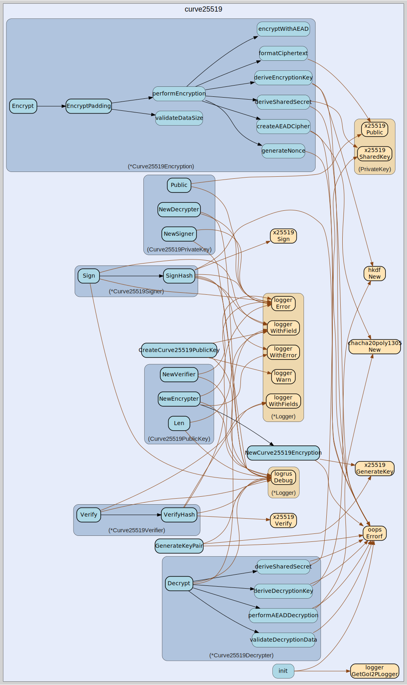

# curve25519
--
    import "github.com/go-i2p/crypto/curve25519"




## Usage

```go
var (
	// ErrDataTooBig indicates that input data exceeds the maximum size for Curve25519 encryption.
	// The maximum allowed size is 1024 bytes to support I2P tunnel build records and protocol requirements.
	ErrDataTooBig = oops.Errorf("data too big for Curve25519 encryption")

	// ErrInvalidPublicKey indicates that a Curve25519 public key has invalid format or size.
	// Valid X25519 public keys must be exactly 32 bytes in length and contain valid curve points.
	ErrInvalidPublicKey = oops.Errorf("invalid public key for Curve25519")

	// ErrInvalidPrivateKey indicates that a Curve25519 private key has invalid format or size.
	// Valid X25519 private keys must be exactly 32 bytes and within the valid scalar range.
	ErrInvalidPrivateKey = oops.Errorf("invalid private key for Curve25519")

	// ErrInvalidSignature indicates that a Curve25519 signature verification failed.
	// This occurs when the signature doesn't match the expected format or fails cryptographic verification.
	ErrInvalidSignature = oops.Errorf("invalid signature for Curve25519")

	// ErrDecryptionFailed indicates that Curve25519 decryption operation failed.
	// This typically occurs due to corrupted ciphertext, wrong keys, or invalid data format.
	ErrDecryptionFailed = oops.Errorf("failed to decrypt data with Curve25519")
)
```
Error constants for Curve25519 cryptographic operations. These errors provide
specific failure modes for X25519 elliptic curve operations including
encryption, decryption, signing, verification, and key management.

#### func  CreateCurve25519PublicKey

```go
func CreateCurve25519PublicKey(data []byte) (k *x25519.PublicKey)
```
CreateCurve25519PublicKey creates a Curve25519 public key from raw byte data.
This function validates the input data length and constructs a proper X25519
public key. The data must be exactly 32 bytes to match the X25519 public key
size specification. Returns nil if the input data length is invalid, otherwise
returns a pointer to the created key.

#### func  GenerateKeyPair

```go
func GenerateKeyPair() (types.PublicEncryptionKey, types.PrivateEncryptionKey, error)
```
GenerateKeyPair generates a new Curve25519 key pair for encryption/decryption
operations. Returns the public key, private key, and any error that occurred
during generation. Moved from: curve25519.go

#### type Curve25519Decrypter

```go
type Curve25519Decrypter struct {
}
```

Curve25519Decrypter handles Curve25519-based decryption operations. This type
implements the types.Decrypter interface and provides X25519 elliptic curve
decryption using ChaCha20-Poly1305 AEAD for secure data decryption in I2P
network protocols.

#### func (*Curve25519Decrypter) Decrypt

```go
func (c *Curve25519Decrypter) Decrypt(data []byte) ([]byte, error)
```
Decrypt decrypts data that was encrypted using Curve25519 and ChaCha20-Poly1305
AEAD. The encrypted data format is:
[ephemeral_public_key][nonce][aead_ciphertext] This method performs X25519 key
exchange with the ephemeral public key, derives the decryption key using
HKDF-SHA256, and then decrypts the data using ChaCha20-Poly1305 authenticated
encryption. The minimum data size is 60 bytes (32-byte public key + 12-byte
nonce + 16-byte tag).

#### type Curve25519Encryption

```go
type Curve25519Encryption struct {
}
```

Curve25519Encryption handles Curve25519-based encryption operations. This type
provides X25519 elliptic curve encryption using ChaCha20-Poly1305 AEAD for
secure data encryption in I2P network protocols with ephemeral key exchange.

#### func  NewCurve25519Encryption

```go
func NewCurve25519Encryption(pub *x25519.PublicKey, rand io.Reader) (*Curve25519Encryption, error)
```
NewCurve25519Encryption creates a new Curve25519 encryption instance for
encrypting data. This function generates an ephemeral key pair and prepares the
encryption context for secure communication with the provided recipient public
key. The ephemeral key provides forward secrecy ensuring that encrypted data
cannot be decrypted even if long-term keys are compromised. Returns
ErrInvalidPublicKey if the public key is nil or has invalid size (must be 32
bytes).

#### func (*Curve25519Encryption) Encrypt

```go
func (c *Curve25519Encryption) Encrypt(data []byte) ([]byte, error)
```
Encrypt encrypts data using Curve25519 and ChaCha20-Poly1305 with automatic zero
padding. This method provides a simplified interface for encryption operations
with default padding enabled. The maximum data size is 1024 bytes to support I2P
tunnel build records and network protocols. Returns encrypted data in format:
[zero_padding][ephemeral_pubkey][nonce][aead_ciphertext]

#### func (*Curve25519Encryption) EncryptPadding

```go
func (c *Curve25519Encryption) EncryptPadding(data []byte, zeroPadding bool) ([]byte, error)
```
EncryptPadding encrypts data using Curve25519 and ChaCha20-Poly1305 with
optional zero padding. This method performs X25519 key exchange with the
recipient's public key, derives an encryption key using HKDF-SHA256, and
encrypts the data using ChaCha20-Poly1305 authenticated encryption. The
zeroPadding parameter controls whether to prepend a zero byte to the output
format. Maximum data size is 1024 bytes to support I2P tunnel data minus
overhead requirements.

#### type Curve25519PrivateKey

```go
type Curve25519PrivateKey []byte
```

Curve25519PrivateKey represents a Curve25519 private key for decryption and
signing operations. This type implements the types.PrivateEncryptionKey
interface and provides X25519 elliptic curve cryptographic operations including
key derivation, decryption, and digital signature creation.

#### func (Curve25519PrivateKey) Bytes

```go
func (k Curve25519PrivateKey) Bytes() []byte
```
Bytes returns the raw byte representation of the Curve25519 private key. The
returned slice contains the 32-byte X25519 private key material in little-endian
format. This implements the types.PrivateKey interface for key serialization and
storage operations.

#### func (Curve25519PrivateKey) NewDecrypter

```go
func (k Curve25519PrivateKey) NewDecrypter() (types.Decrypter, error)
```
NewDecrypter creates a new Curve25519 decrypter for decrypting data encrypted to
this private key. The decrypter uses X25519 elliptic curve Diffie-Hellman key
exchange combined with ChaCha20-Poly1305 AEAD decryption to provide secure
decryption of data encrypted with the corresponding public key. Returns
ErrInvalidPrivateKey if the private key size is invalid (must be 32 bytes).

#### func (Curve25519PrivateKey) NewSigner

```go
func (k Curve25519PrivateKey) NewSigner() (types.Signer, error)
```
NewSigner creates a new Curve25519 signer for creating digital signatures with
this private key. The signer uses X25519 elliptic curve digital signature
algorithms to create cryptographically secure signatures that can be verified
using the corresponding Curve25519 public key. Returns ErrInvalidPrivateKey if
the private key size is invalid (must be 32 bytes).

#### func (Curve25519PrivateKey) Public

```go
func (k Curve25519PrivateKey) Public() (types.PublicEncryptionKey, error)
```
Public derives the corresponding public key from this Curve25519 private key.
This method implements the types.PrivateEncryptionKey interface and uses X25519
scalar multiplication to compute the public key point on the curve. The
operation is mathematically equivalent to computing pubkey = privkey * basepoint
on the Curve25519 elliptic curve. Returns ErrInvalidPrivateKey if the private
key size is invalid (must be 32 bytes).

#### func (Curve25519PrivateKey) Zero

```go
func (k Curve25519PrivateKey) Zero()
```
Zero securely clears the private key material from memory. This method
implements the types.PrivateKey interface and overwrites all bytes of the
private key with zeros to prevent sensitive cryptographic material from
remaining in memory after use. This is essential for maintaining security in
cryptographic applications.

#### type Curve25519PublicKey

```go
type Curve25519PublicKey []byte
```

Curve25519PublicKey represents a Curve25519 public key for encryption and
signature verification. This type implements the types.PublicEncryptionKey
interface and provides X25519 elliptic curve cryptographic operations for I2P
network encryption and ECDH key exchange protocols.

#### func (Curve25519PublicKey) Bytes

```go
func (k Curve25519PublicKey) Bytes() []byte
```
Bytes returns the raw byte representation of the Curve25519 public key. The
returned slice contains the 32-byte X25519 public key material in little-endian
format suitable for cryptographic operations and network transmission.

#### func (Curve25519PublicKey) Len

```go
func (k Curve25519PublicKey) Len() int
```
Len returns the length of the Curve25519 public key in bytes. For X25519 public
keys, this will always return 32 bytes as defined by the curve specification.
This method is used for key validation and buffer allocation in cryptographic
operations.

#### func (Curve25519PublicKey) NewEncrypter

```go
func (k Curve25519PublicKey) NewEncrypter() (types.Encrypter, error)
```
NewEncrypter creates a new Curve25519 encrypter for encrypting data to this
public key. The encrypter uses X25519 elliptic curve Diffie-Hellman key exchange
combined with ChaCha20-Poly1305 AEAD encryption to provide secure encryption
suitable for I2P network protocols. Returns ErrInvalidPublicKey if the key size
is invalid (must be 32 bytes).

#### func (Curve25519PublicKey) NewVerifier

```go
func (k Curve25519PublicKey) NewVerifier() (types.Verifier, error)
```
NewVerifier creates a Curve25519 verifier for signature verification operations.
This method validates the public key size and returns a verifier instance
capable of verifying signatures created with the corresponding Curve25519
private key using X25519 signature algorithms. Returns ErrInvalidPublicKey if
the key size is invalid (must be 32 bytes).

#### type Curve25519Signer

```go
type Curve25519Signer struct {
}
```

Curve25519Signer handles Curve25519-based digital signature creation operations.
This type implements the types.Signer interface and provides X25519 elliptic
curve signature generation using SHA-512 hashing for data integrity and
authentication in I2P network protocols.

#### func (*Curve25519Signer) Sign

```go
func (s *Curve25519Signer) Sign(data []byte) ([]byte, error)
```
Sign creates a digital signature of the provided data using Curve25519
cryptography. This method automatically hashes the input data using SHA-512
before signing to ensure data integrity. The signature can be verified using the
corresponding Curve25519 public key and the original data. Returns
ErrInvalidPrivateKey if the private key size is invalid (must be 32 bytes).

#### func (*Curve25519Signer) SignHash

```go
func (s *Curve25519Signer) SignHash(h []byte) ([]byte, error)
```
SignHash creates a digital signature of a pre-computed hash using Curve25519
cryptography. This method accepts a pre-hashed input (typically SHA-512) and
creates a cryptographic signature using X25519 elliptic curve algorithms. This
is useful when the hash has already been computed or when implementing custom
hash functions for specific I2P protocol requirements.

#### type Curve25519Verifier

```go
type Curve25519Verifier struct {
}
```

Curve25519Verifier handles Curve25519-based digital signature verification
operations. This type implements the types.Verifier interface and provides
X25519 elliptic curve signature verification using SHA-512 hashing for
authenticating data integrity in I2P network protocols.

#### func (*Curve25519Verifier) Verify

```go
func (v *Curve25519Verifier) Verify(data, sig []byte) error
```
Verify verifies a digital signature against the provided data using Curve25519
cryptography. This method automatically hashes the input data using SHA-512
before verification to ensure data integrity. It validates that the signature
was created by the private key corresponding to this public key using the
provided data. This is the primary method for signature verification in I2P
protocols.

#### func (*Curve25519Verifier) VerifyHash

```go
func (v *Curve25519Verifier) VerifyHash(h, sig []byte) error
```
VerifyHash verifies a digital signature against a pre-computed hash using
Curve25519 cryptography. This method validates that the signature was created by
the private key corresponding to this public key using the provided hash. The
hash should typically be computed using SHA-512 for security. Returns
types.ErrBadSignatureSize for invalid signature length, ErrInvalidPublicKey for
invalid key, or ErrInvalidSignature if verification fails.


curve25519 

github.com/go-i2p/crypto/curve25519

[go-i2p template file](/template.md)
