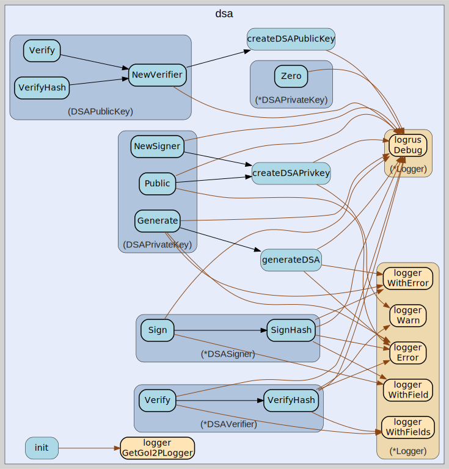

# dsa
--
    import "github.com/go-i2p/crypto/dsa"




## Usage

#### type DSAPrivateKey

```go
type DSAPrivateKey [20]byte
```

DSAPrivateKey represents a DSA private key using a 20-byte array format. This
type implements the I2P standard DSA private key representation where the
private key value (X) is stored as a 160-bit (20-byte) big-endian integer.
DSAPrivateKey satisfies the types.SigningPrivateKey interface for digital
signatures.

#### func (DSAPrivateKey) Bytes

```go
func (k DSAPrivateKey) Bytes() []byte
```
Bytes returns the raw byte representation of this DSA private key. The returned
bytes contain the complete private key material in I2P format, representing the
160-bit private key value X as a big-endian integer. This method is required by
the types.SigningPrivateKey interface.

#### func (DSAPrivateKey) Generate

```go
func (k DSAPrivateKey) Generate() (types.SigningPrivateKey, error)
```
Generate creates a new random DSA private key pair using cryptographically
secure randomness. This method generates a fresh DSA private key using the
standard I2P DSA parameters (1024-bit p, 160-bit q). The generated private key
value X is securely random and mathematically valid for DSA operations. Returns
a new DSAPrivateKey or an error if key generation fails due to insufficient
entropy.

#### func (DSAPrivateKey) Len

```go
func (k DSAPrivateKey) Len() int
```
Len returns the length of this DSA private key in bytes. DSA private keys in I2P
format are always 20 bytes (160 bits) as specified by the DSA standard for the
private key value X. This method is required by the types.SigningPrivateKey
interface for key size validation.

#### func (DSAPrivateKey) NewSigner

```go
func (k DSAPrivateKey) NewSigner() (s types.Signer, err error)
```
NewSigner creates a new DSA signer instance using this private key. The returned
signer can generate DSA signatures for data and pre-computed hashes. Returns a
DSASigner implementing the types.Signer interface or an error if the private key
format is invalid or signer creation fails. Example usage: signer, err :=
privateKey.NewSigner()

#### func (DSAPrivateKey) Public

```go
func (k DSAPrivateKey) Public() (types.SigningPublicKey, error)
```
Public extracts the corresponding DSA public key from this private key. This
method derives the public key (Y = g^X mod p) using standard DSA mathematics
without exposing the private key material. Returns the public key as
DSAPublicKey or an error if the private key format is invalid or derivation
fails.

#### func (*DSAPrivateKey) Zero

```go
func (k *DSAPrivateKey) Zero()
```
Zero securely clears all sensitive private key data from memory. This method
overwrites the private key material with zeros to prevent memory disclosure
attacks. After calling Zero, the key becomes unusable for cryptographic
operations. This method is required by the types.SigningPrivateKey interface.

#### type DSAPublicKey

```go
type DSAPublicKey [128]byte
```

DSAPublicKey represents a DSA public key using a 128-byte array format. This
type implements the I2P standard DSA public key representation where the public
key value (Y = g^X mod p) is stored as a 1024-bit (128-byte) big-endian integer.
DSAPublicKey satisfies the types.SigningPublicKey interface for signature
verification.

#### func (DSAPublicKey) Bytes

```go
func (k DSAPublicKey) Bytes() []byte
```
Bytes returns the raw byte representation of this DSA public key. The returned
bytes contain the complete public key material in I2P format, representing the
1024-bit public key value Y as a big-endian integer. This method is required by
the types.SigningPublicKey interface.

#### func (DSAPublicKey) Len

```go
func (k DSAPublicKey) Len() int
```
Len returns the length of this DSA public key in bytes. DSA public keys in I2P
format are always 128 bytes (1024 bits) as specified by the I2P DSA standard.
This method is required by the types.SigningPublicKey interface for key size
validation and serialization purposes.

#### func (DSAPublicKey) NewVerifier

```go
func (k DSAPublicKey) NewVerifier() (v types.Verifier, err error)
```
NewVerifier creates a new DSA signature verifier using this public key. The
returned verifier can validate DSA signatures against data and pre-computed
hashes. Returns a DSAVerifier implementing the types.Verifier interface or an
error if the public key format is invalid or verifier creation fails. Example
usage: verifier, err := publicKey.NewVerifier()

#### func (DSAPublicKey) Verify

```go
func (k DSAPublicKey) Verify(data, sig []byte) error
```
Verify validates a DSA signature against the provided data using this public
key. This method provides a convenient interface for signature verification by
creating a verifier instance and calling its Verify method. The signature must
be in I2P format as a 40-byte array. Returns nil if the signature is valid, or
an error if verification fails or the key/signature format is invalid.

#### func (DSAPublicKey) VerifyHash

```go
func (k DSAPublicKey) VerifyHash(h, sig []byte) error
```
VerifyHash validates a DSA signature against a pre-computed hash using this
public key. This method provides a convenient interface for hash signature
verification by creating a verifier instance and calling its VerifyHash method.
The hash should be 20 bytes (SHA-1) and the signature must be 40 bytes in I2P
format. Returns nil if the signature is valid.

#### type DSASigner

```go
type DSASigner struct {
}
```

DSASigner provides DSA digital signature creation functionality. This type
implements the types.Signer interface for generating DSA signatures using SHA-1
hash algorithm as specified by the I2P protocol. DSASigner wraps a standard
crypto/dsa.PrivateKey and provides I2P-compatible signature formatting.

#### func (*DSASigner) Sign

```go
func (ds *DSASigner) Sign(data []byte) (sig []byte, err error)
```
Sign generates a DSA signature for the provided data using SHA-1 hashing. This
method first computes the SHA-1 hash of the input data, then creates a DSA
signature using the standard DSA algorithm (r, s) values. The signature is
returned in I2P format as a 40-byte array containing r (20 bytes) followed by s
(20 bytes). Returns the signature bytes or an error if signing fails due to
invalid key or data.

#### func (*DSASigner) SignHash

```go
func (ds *DSASigner) SignHash(h []byte) (sig []byte, err error)
```
SignHash generates a DSA signature for a pre-computed hash digest. This method
creates a DSA signature directly from a hash digest using the DSA algorithm. The
hash should be 20 bytes (SHA-1) for optimal security and I2P compatibility.
Returns a 40-byte signature in I2P format (r||s) or an error if signing fails.
This is the primary signing method for performance-critical applications.

#### type DSAVerifier

```go
type DSAVerifier struct {
}
```

DSAVerifier provides DSA digital signature verification functionality. This type
implements the types.Verifier interface for validating DSA signatures using
SHA-1 hash algorithm as specified by the I2P protocol. DSAVerifier wraps a
standard crypto/dsa.PublicKey and provides I2P-compatible signature validation.

#### func (*DSAVerifier) Verify

```go
func (v *DSAVerifier) Verify(data, sig []byte) (err error)
```
Verify validates a DSA signature against the provided data using SHA-1 hashing.
This method first computes the SHA-1 hash of the input data, then validates the
DSA signature using the standard DSA verification algorithm. The signature must
be in I2P format as a 40-byte array containing r (20 bytes) followed by s (20
bytes). Returns nil if the signature is valid, or an error if verification
fails.

#### func (*DSAVerifier) VerifyHash

```go
func (v *DSAVerifier) VerifyHash(h, sig []byte) (err error)
```
VerifyHash validates a DSA signature against a pre-computed hash digest. This
method validates a DSA signature directly from a hash digest using the DSA
verification algorithm. The hash should be 20 bytes (SHA-1) and the signature
must be 40 bytes in I2P format (r||s). Returns nil if the signature is
mathematically valid for the hash, or an error if verification fails. This is
the primary verification method for performance-critical applications.


dsa 

github.com/go-i2p/crypto/dsa

[go-i2p template file](/template.md)
