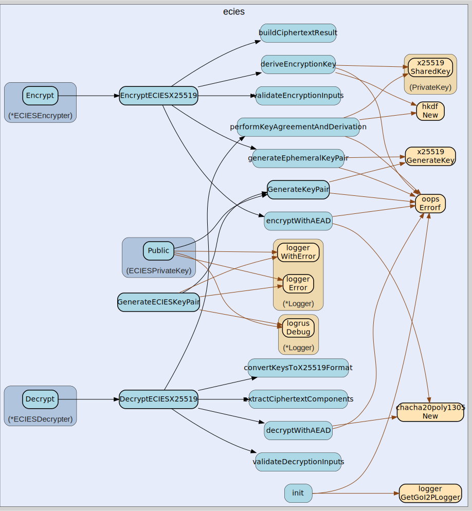

# ecies
--
    import "github.com/go-i2p/crypto/ecies"



Package ecies constants for ECIES-X25519-AEAD-Ratchet encryption. Moved from:
ecies.go

Package ecies implements ECIES-X25519-AEAD-Ratchet encryption as specified in
I2P Proposal 144.

This package provides the modern I2P encryption scheme that replaces
ElGamal/AES+SessionTags. It implements ephemeral-static and ephemeral-ephemeral
Diffie-Hellman key agreement using X25519, combined with ChaCha20-Poly1305 AEAD
encryption.

The implementation follows I2P Proposal 144 specification:
https://geti2p.net/spec/proposals/144-ecies-x25519-aead-ratchet

Package ecies key derivation functions for ECIES-X25519-AEAD-Ratchet protocol.

Package ecies session state management for ECIES-X25519-AEAD-Ratchet protocol.

Package ecies utility functions for ECIES-X25519-AEAD-Ratchet encryption. Moved
from: ecies.go

## Usage

```go
const (
	// PublicKeySize is the size of X25519 public keys in bytes
	PublicKeySize = 32
	// PrivateKeySize is the size of X25519 private keys in bytes
	PrivateKeySize = 32
	// NonceSize is the size of ChaCha20-Poly1305 nonces in bytes
	NonceSize = 12
	// TagSize is the size of Poly1305 authentication tags in bytes
	TagSize = 16
	// MaxPlaintextSize is the maximum size of plaintext data for encryption
	MaxPlaintextSize = 1024
)
```
Constants for ECIES-X25519 implementation Moved from: ecies.go

```go
var (
	ErrInvalidPublicKey           = oops.Errorf("invalid public key for ECIES-X25519")
	ErrInvalidPrivateKey          = oops.Errorf("invalid private key for ECIES-X25519")
	ErrDataTooBig                 = oops.Errorf("data too large for ECIES-X25519 encryption")
	ErrInvalidCiphertext          = oops.Errorf("invalid ciphertext for ECIES-X25519 decryption")
	ErrDecryptionFailed           = oops.Errorf("ECIES-X25519 decryption failed")
	ErrKeyDerivationFailed        = oops.Errorf("ECIES-X25519 key derivation failed")
	ErrNotElligator2Representable = oops.Errorf("public key is not Elligator2-representable")
)
```
Error constants for ECIES operations Moved from: ecies.go

#### func  DecryptECIESX25519

```go
func DecryptECIESX25519(recipientPrivKey, ciphertext []byte) ([]byte, error)
```
DecryptECIESX25519 decrypts ciphertext using ECIES-X25519 scheme. The private
key must be 32 bytes (X25519 private key). The ciphertext must be in the format:
[ephemeral_pubkey][nonce][aead_ciphertext] Moved from: ecies.go

#### func  DeriveChaCha20Key

```go
func DeriveChaCha20Key(messageKey [32]byte) ([32]byte, error)
```
DeriveChaCha20Key derives a ChaCha20 encryption key from a message key. Some
implementations may need this extra derivation step.

#### func  DeriveChaCha20Nonce

```go
func DeriveChaCha20Nonce(messageKey [32]byte, messageNum uint32) ([12]byte, error)
```
DeriveChaCha20Nonce derives a ChaCha20 nonce from a message key and message
number. Returns a 12-byte nonce suitable for ChaCha20-Poly1305.

#### func  DeriveMessageKey

```go
func DeriveMessageKey(chainKey []byte, messageNumber uint32) ([32]byte, error)
```
DeriveMessageKey derives a message encryption key from a chain key. This is used
by the symmetric key ratchet. chainKey: The current chain key (32 bytes)
messageNumber: The message sequence number for this key Returns (messageKey,
error)

#### func  DeriveNoiseKeys

```go
func DeriveNoiseKeys(sharedSecret, info []byte) ([32]byte, [32]byte, [32]byte, error)
```
DeriveNoiseKeys derives keys using the Noise protocol pattern. This is
specifically for ECIES session establishment following Noise_X pattern.
sharedSecret: Output from X25519 DH info: Context string for domain separation
Returns (sendKey, recvKey, chainKey, error)

#### func  DeriveSessionKeys

```go
func DeriveSessionKeys(sharedSecret, info []byte) ([32]byte, [32]byte, error)
```
DeriveSessionKeys derives the initial session keys from a shared secret. This is
used during session establishment to derive: - Sending chain key (32 bytes) -
Receiving chain key (32 bytes) Returns (sendKey, recvKey, error)

#### func  DeriveSessionTag

```go
func DeriveSessionTag(chainKey []byte, tagNumber uint32) ([8]byte, error)
```
DeriveSessionTag derives a session tag from a chain key. This is used by the
session tag ratchet. chainKey: The current chain key (32 bytes) tagNumber: The
tag sequence number Returns (tag, error) where tag is 8 bytes

#### func  EncryptECIESX25519

```go
func EncryptECIESX25519(recipientPubKey, plaintext []byte) ([]byte, error)
```
EncryptECIESX25519 encrypts plaintext using ECIES-X25519 scheme. This implements
the "New Session" message format from I2P Proposal 144. The recipient's public
key must be 32 bytes (X25519 public key). Returns ciphertext in the format:
[ephemeral_pubkey][nonce][aead_ciphertext] Moved from: ecies.go

#### func  GenerateECIESKeyPair

```go
func GenerateECIESKeyPair() (*ECIESPublicKey, *ECIESPrivateKey, error)
```
GenerateECIESKeyPair generates a new ECIES key pair using the standard interface
types

#### func  GenerateKeyPair

```go
func GenerateKeyPair() ([]byte, []byte, error)
```
GenerateKeyPair generates a new X25519 key pair suitable for ECIES-X25519.
Returns (publicKey, privateKey, error) where keys are 32 bytes each. Moved from:
ecies.go

#### type ECIESDecrypter

```go
type ECIESDecrypter struct {
	PrivateKey ECIESPrivateKey
}
```

ECIESDecrypter implements types.Decrypter using ECIES

#### func (*ECIESDecrypter) Decrypt

```go
func (d *ECIESDecrypter) Decrypt(data []byte) ([]byte, error)
```
Decrypt decrypts data using ECIES-X25519

#### type ECIESEncrypter

```go
type ECIESEncrypter struct {
	PublicKey ECIESPublicKey
}
```

ECIESEncrypter implements types.Encrypter using ECIES

#### func (*ECIESEncrypter) Encrypt

```go
func (e *ECIESEncrypter) Encrypt(data []byte) ([]byte, error)
```
Encrypt encrypts data using ECIES-X25519

#### type ECIESPrivateKey

```go
type ECIESPrivateKey [PrivateKeySize]byte
```

ECIESPrivateKey represents an ECIES X25519 private key for decryption

#### func (ECIESPrivateKey) Bytes

```go
func (k ECIESPrivateKey) Bytes() []byte
```
Bytes returns the private key as a byte slice

#### func (ECIESPrivateKey) Len

```go
func (k ECIESPrivateKey) Len() int
```
Len returns the length of the private key in bytes

#### func (ECIESPrivateKey) NewDecrypter

```go
func (k ECIESPrivateKey) NewDecrypter() (types.Decrypter, error)
```
NewDecrypter creates a new decrypter using this private key

#### func (ECIESPrivateKey) Public

```go
func (k ECIESPrivateKey) Public() (types.PublicEncryptionKey, error)
```
Public returns the corresponding public key

#### func (ECIESPrivateKey) Zero

```go
func (k ECIESPrivateKey) Zero()
```
Zero securely clears the private key from memory

#### type ECIESPublicKey

```go
type ECIESPublicKey [PublicKeySize]byte
```

ECIESPublicKey represents an ECIES X25519 public key for encryption

#### func (ECIESPublicKey) Bytes

```go
func (k ECIESPublicKey) Bytes() []byte
```
Bytes returns the public key as a byte slice

#### func (ECIESPublicKey) Len

```go
func (k ECIESPublicKey) Len() int
```
Len returns the length of the public key in bytes

#### func (ECIESPublicKey) NewEncrypter

```go
func (k ECIESPublicKey) NewEncrypter() (types.Encrypter, error)
```
NewEncrypter creates a new encrypter using this public key

#### type SessionState

```go
type SessionState struct {

	// Session identification
	SessionID [32]byte

	// Static keys
	LocalPrivKey       [32]byte // Our static private key
	RemoteStaticPubKey [32]byte // Remote peer's static public key

	// Ratchet state - Sending chain
	SendingChainKey   [32]byte // Current sending chain key
	SendingMessageNum uint32   // Next message number to send

	// Ratchet state - Receiving chain
	ReceivingChainKey   [32]byte // Current receiving chain key
	ReceivingMessageNum uint32   // Next expected message number

	// DH Ratchet state
	DHRatchetPrivKey [32]byte // Our current DH ratchet private key
	DHRatchetPubKey  [32]byte // Our current DH ratchet public key
	RemoteDHPubKey   [32]byte // Remote peer's current DH ratchet public key

	// Session tag ratchets
	SendingTagRatchet   *ratchet.TagRatchet // Derives outgoing session tags
	ReceivingTagRatchet *ratchet.TagRatchet // Derives incoming session tags

	// Previous chain length for message ordering
	PreviousChainLength uint32

	// Session creation timestamp
	CreatedAt int64
}
```

SessionState tracks the state of an ECIES session with forward secrecy. It
implements the three-level ratcheting mechanism from I2P Proposal 144: 1.
Session Tag Ratchet - Derives unique session tags for message routing 2.
Symmetric Key Ratchet - Derives message encryption keys 3. DH Ratchet - Provides
forward secrecy through ephemeral key exchanges

#### func  NewSession

```go
func NewSession(localPrivKey, remoteStaticPubKey []byte, isInitiator bool) (*SessionState, error)
```
NewSession creates a new ECIES session state. localPrivKey: Our static X25519
private key (32 bytes) remoteStaticPubKey: Remote peer's static X25519 public
key (32 bytes) isInitiator: True if we are initiating the session, false if
responding

#### func (*SessionState) DeriveNextReceivingKey

```go
func (s *SessionState) DeriveNextReceivingKey() ([32]byte, error)
```
DeriveNextReceivingKey derives the next message decryption key from the
receiving chain. This implements the symmetric key ratchet for receiving.

#### func (*SessionState) DeriveNextSendingKey

```go
func (s *SessionState) DeriveNextSendingKey() ([32]byte, error)
```
DeriveNextSendingKey derives the next message encryption key from the sending
chain. This implements the symmetric key ratchet for sending.

#### func (*SessionState) GetDHRatchetPublicKey

```go
func (s *SessionState) GetDHRatchetPublicKey() [32]byte
```
GetDHRatchetPublicKey returns our current DH ratchet public key.

#### func (*SessionState) GetNextSendingTag

```go
func (s *SessionState) GetNextSendingTag() ([8]byte, error)
```
GetNextSendingTag derives the next session tag for sending an existing session
message.

#### func (*SessionState) GetSessionID

```go
func (s *SessionState) GetSessionID() [32]byte
```
GetSessionID returns the session identifier.

#### func (*SessionState) PerformDHRatchet

```go
func (s *SessionState) PerformDHRatchet(remoteDHPubKey []byte) error
```
PerformDHRatchet performs a DH ratchet step, providing forward secrecy. This
should be called when we receive a new DH public key from the remote peer.

#### func (*SessionState) ValidateReceivingTag

```go
func (s *SessionState) ValidateReceivingTag(tag [8]byte) (bool, error)
```
ValidateReceivingTag checks if a received tag matches the expected tag in the
receiving ratchet.

#### func (*SessionState) Zero

```go
func (s *SessionState) Zero()
```
Zero securely clears sensitive session data from memory.


ecies 

github.com/go-i2p/crypto/ecies

[go-i2p template file](/template.md)
