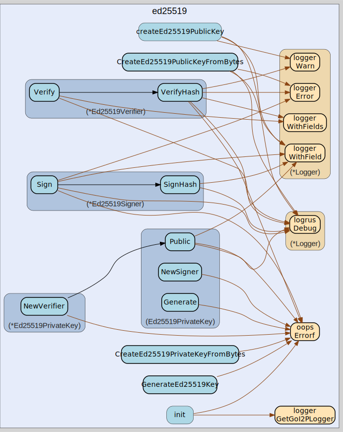

# ed25519
--
    import "github.com/go-i2p/crypto/ed25519"



Package ed25519 provides Ed25519 digital signature functionality for I2P
cryptographic operations. This package implements the Ed25519 signature
algorithm as defined in RFC 8032, providing high-security digital signatures
with small key sizes and fast verification. Note: Ed25519 is for signatures only
- use curve25519 package for encryption operations.

## Usage

```go
var (
	ErrInvalidPublicKeySize = oops.Errorf("failed to verify: invalid ed25519 public key size")
)
```
ErrInvalidPublicKeySize indicates an Ed25519 public key does not meet the
required 32-byte size. Error constants for Ed25519 operations Moved from:
ed25519.go

#### func  GenerateEd25519Key

```go
func GenerateEd25519Key() (types.SigningPrivateKey, error)
```
GenerateEd25519Key generates a new Ed25519 private key for digital signatures.
This function creates a cryptographically secure Ed25519 keypair using the
system's random number generator. The returned private key implements the
SigningPrivateKey interface. Example usage: privKey, err := GenerateEd25519Key()
GenerateEd25519Key generates a new Ed25519 private key for digital signatures.
Returns a private key that implements the SigningPrivateKey interface. Moved
from: ed25519.go

#### type Ed25519PrivateKey

```go
type Ed25519PrivateKey ed25519.PrivateKey
```

Ed25519PrivateKey represents an Ed25519 private key for digital signature
operations. This key type implements the SigningPrivateKey interface and
provides methods for signing data and generating verifiers. Ed25519 keys are 64
bytes in length.

#### func  CreateEd25519PrivateKeyFromBytes

```go
func CreateEd25519PrivateKeyFromBytes(data []byte) (Ed25519PrivateKey, error)
```
CreateEd25519PrivateKeyFromBytes constructs an Ed25519 private key from raw byte
data. The input data must be exactly 64 bytes representing a valid Ed25519
private key. Returns an error if the data length is incorrect or the key format
is invalid.

#### func (Ed25519PrivateKey) Bytes

```go
func (k Ed25519PrivateKey) Bytes() []byte
```
Bytes returns the raw byte representation of the Ed25519 private key. The
returned slice contains the full 64-byte Ed25519 private key including the
embedded public key portion. This method is used for serialization.

#### func (Ed25519PrivateKey) Generate

```go
func (k Ed25519PrivateKey) Generate() (types.SigningPrivateKey, error)
```
Generate creates a new random Ed25519 private key using secure random
generation. This method generates a fresh keypair and returns it as a
SigningPrivateKey interface. The generated key is cryptographically secure and
suitable for production use.

#### func (Ed25519PrivateKey) Len

```go
func (k Ed25519PrivateKey) Len() int
```
Len returns the length of the Ed25519 private key in bytes. Ed25519 private keys
are always 64 bytes long, containing both private and public key material as
specified in RFC 8032.

#### func (Ed25519PrivateKey) NewSigner

```go
func (k Ed25519PrivateKey) NewSigner() (types.Signer, error)
```
NewSigner creates a new signer instance for generating Ed25519 digital
signatures. Returns a signer that can sign arbitrary data using this private
key. The signer automatically handles hash computation before signing.

#### func (*Ed25519PrivateKey) NewVerifier

```go
func (k *Ed25519PrivateKey) NewVerifier() (types.Verifier, error)
```
NewVerifier creates a verifier instance from this private key's public
component. This method extracts the public key and returns a verifier that can
validate signatures created by this private key. Returns an error if the private
key size is invalid. NewVerifier implements types.SigningPublicKey.

#### func (Ed25519PrivateKey) Public

```go
func (k Ed25519PrivateKey) Public() (types.SigningPublicKey, error)
```
Public extracts the Ed25519 public key from this private key. Returns the
corresponding public key that can be used for signature verification. The public
key is derived from the private key's embedded public component.

#### func (Ed25519PrivateKey) Zero

```go
func (k Ed25519PrivateKey) Zero()
```
Zero securely clears the private key material from memory. This method
overwrites all bytes of the private key with zeros to prevent potential memory
disclosure attacks. Should be called when the key is no longer needed.

#### type Ed25519PublicKey

```go
type Ed25519PublicKey []byte
```

Ed25519PublicKey represents an Ed25519 public key for signature verification
operations. This key type implements the SigningPublicKey interface and is used
to verify digital signatures created by corresponding Ed25519 private keys.
Public keys are 32 bytes in length.

#### func  CreateEd25519PublicKeyFromBytes

```go
func CreateEd25519PublicKeyFromBytes(data []byte) (Ed25519PublicKey, error)
```
CreateEd25519PublicKeyFromBytes constructs an Ed25519 public key from raw byte
data. The input data must be exactly 32 bytes representing a valid Ed25519
public key. Returns an error if the data length doesn't match the required
Ed25519 public key size.

#### func (Ed25519PublicKey) Bytes

```go
func (k Ed25519PublicKey) Bytes() []byte
```
Bytes returns the raw byte representation of the Ed25519 public key. The
returned slice contains the 32-byte public key data suitable for serialization,
transmission, or storage operations.

#### func (Ed25519PublicKey) Len

```go
func (k Ed25519PublicKey) Len() int
```
Len returns the length of the Ed25519 public key in bytes. Ed25519 public keys
are always 32 bytes long as specified in RFC 8032. This method is useful for
validation and serialization operations.

#### func (Ed25519PublicKey) NewVerifier

```go
func (k Ed25519PublicKey) NewVerifier() (v types.Verifier, err error)
```
NewVerifier creates a verifier instance that can validate Ed25519 signatures.
Returns a verifier configured with this public key for signature verification
operations. The verifier can validate signatures created by the corresponding
private key.

#### type Ed25519Signer

```go
type Ed25519Signer struct {
}
```

Ed25519Signer provides digital signature creation using Ed25519 private keys.
This type implements the Signer interface for generating cryptographic
signatures over arbitrary data using the Ed25519 signature algorithm from RFC
8032.

#### func (*Ed25519Signer) Sign

```go
func (s *Ed25519Signer) Sign(data []byte) (sig []byte, err error)
```
Sign creates an Ed25519 digital signature over the provided data. The data is
first hashed using SHA-512 before signing to ensure consistent signature
generation. Returns the signature bytes or an error if signing fails.

#### func (*Ed25519Signer) SignHash

```go
func (s *Ed25519Signer) SignHash(h []byte) (sig []byte, err error)
```
SignHash creates an Ed25519 signature over a pre-computed hash. This method
signs the provided hash directly without additional hashing. The hash should
typically be a SHA-512 digest for Ed25519 compatibility.

#### type Ed25519Verifier

```go
type Ed25519Verifier struct {
}
```

Ed25519Verifier provides digital signature verification using Ed25519 public
keys. This type implements the Verifier interface for validating cryptographic
signatures created by Ed25519 private keys against the corresponding public key.

#### func (*Ed25519Verifier) Verify

```go
func (v *Ed25519Verifier) Verify(data, sig []byte) (err error)
```
Verify validates an Ed25519 signature against arbitrary data. The data is first
hashed using SHA-512 before verification to ensure consistent validation.
Returns an error if verification fails.

#### func (*Ed25519Verifier) VerifyHash

```go
func (v *Ed25519Verifier) VerifyHash(h, sig []byte) (err error)
```
VerifyHash validates an Ed25519 signature against a pre-computed hash. This
method verifies the signature directly against the provided hash without
additional hashing. Returns an error if verification fails or inputs are
invalid.


ed25519 

github.com/go-i2p/crypto/ed25519

[go-i2p template file](/template.md)
