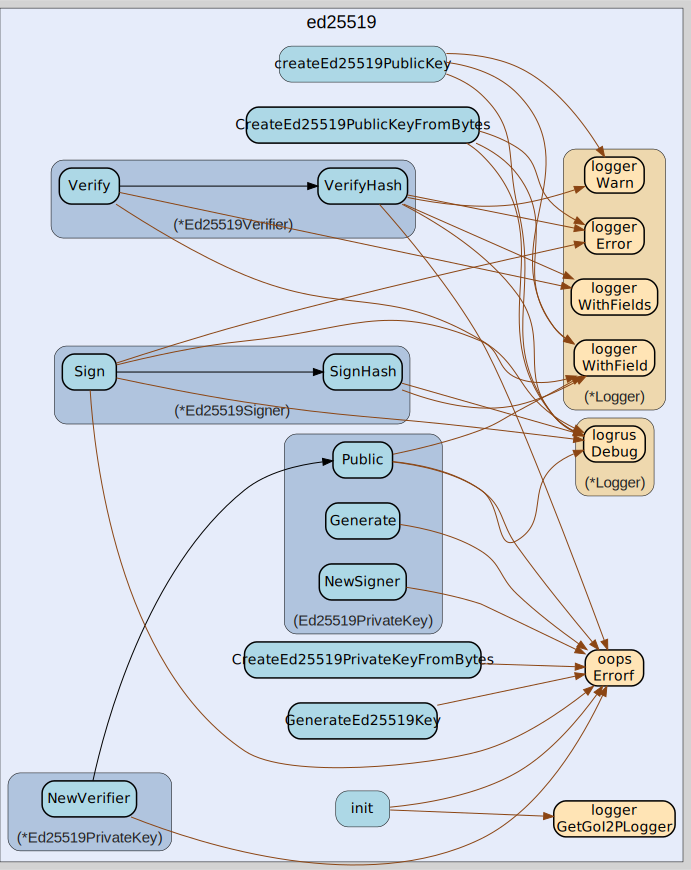

# ed25519
--
    import "github.com/go-i2p/crypto/ed25519"




## Usage

```go
var (
	ErrInvalidPublicKeySize = oops.Errorf("failed to verify: invalid ed25519 public key size")
)
```
Error constants for Ed25519 operations Moved from: ed25519.go

#### func  GenerateEd25519Key

```go
func GenerateEd25519Key() (types.SigningPrivateKey, error)
```
GenerateEd25519Key generates a new Ed25519 private key for digital signatures.
Returns a private key that implements the SigningPrivateKey interface. Moved
from: ed25519.go

#### type Ed25519PrivateKey

```go
type Ed25519PrivateKey ed25519.PrivateKey
```


#### func  CreateEd25519PrivateKeyFromBytes

```go
func CreateEd25519PrivateKeyFromBytes(data []byte) (Ed25519PrivateKey, error)
```

#### func (Ed25519PrivateKey) Bytes

```go
func (k Ed25519PrivateKey) Bytes() []byte
```

#### func (Ed25519PrivateKey) Generate

```go
func (k Ed25519PrivateKey) Generate() (types.SigningPrivateKey, error)
```

#### func (Ed25519PrivateKey) Len

```go
func (k Ed25519PrivateKey) Len() int
```

#### func (Ed25519PrivateKey) NewSigner

```go
func (k Ed25519PrivateKey) NewSigner() (types.Signer, error)
```

#### func (*Ed25519PrivateKey) NewVerifier

```go
func (k *Ed25519PrivateKey) NewVerifier() (types.Verifier, error)
```
NewVerifier implements types.SigningPublicKey.

#### func (Ed25519PrivateKey) Public

```go
func (k Ed25519PrivateKey) Public() (types.SigningPublicKey, error)
```

#### func (Ed25519PrivateKey) Zero

```go
func (k Ed25519PrivateKey) Zero()
```

#### type Ed25519PublicKey

```go
type Ed25519PublicKey []byte
```


#### func  CreateEd25519PublicKeyFromBytes

```go
func CreateEd25519PublicKeyFromBytes(data []byte) (Ed25519PublicKey, error)
```

#### func (Ed25519PublicKey) Bytes

```go
func (k Ed25519PublicKey) Bytes() []byte
```

#### func (Ed25519PublicKey) Len

```go
func (k Ed25519PublicKey) Len() int
```

#### func (Ed25519PublicKey) NewVerifier

```go
func (k Ed25519PublicKey) NewVerifier() (v types.Verifier, err error)
```

#### type Ed25519Signer

```go
type Ed25519Signer struct {
}
```


#### func (*Ed25519Signer) Sign

```go
func (s *Ed25519Signer) Sign(data []byte) (sig []byte, err error)
```

#### func (*Ed25519Signer) SignHash

```go
func (s *Ed25519Signer) SignHash(h []byte) (sig []byte, err error)
```

#### type Ed25519Verifier

```go
type Ed25519Verifier struct {
}
```


#### func (*Ed25519Verifier) Verify

```go
func (v *Ed25519Verifier) Verify(data, sig []byte) (err error)
```

#### func (*Ed25519Verifier) VerifyHash

```go
func (v *Ed25519Verifier) VerifyHash(h, sig []byte) (err error)
```


ed25519 

github.com/go-i2p/crypto/ed25519

[go-i2p template file](/template.md)
