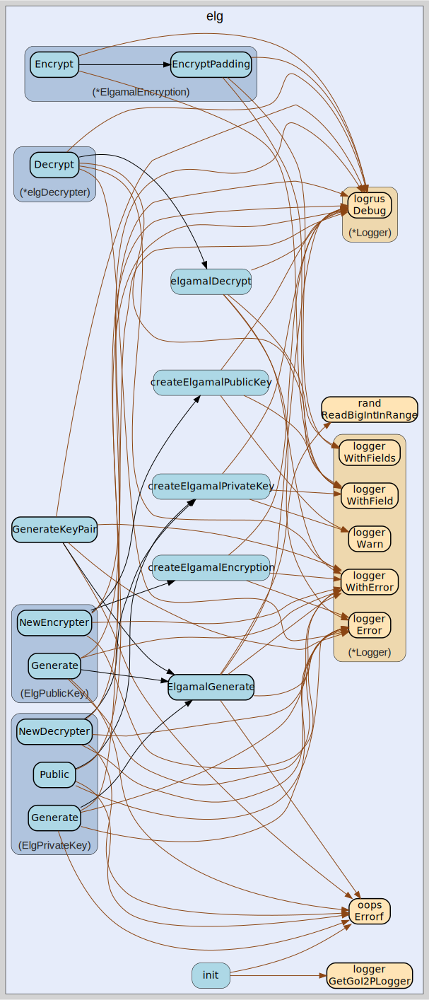

# elg
--
    import "github.com/go-i2p/crypto/elg"



Package elg implements ElGamal encryption and decryption for the I2P anonymous
networking protocol.

This package provides I2P-compatible ElGamal asymmetric encryption using
2048-bit security parameters. ElGamal encryption enables secure message
transmission in the I2P network where the sender encrypts data using the
recipient's public key, and only the recipient can decrypt using their private
key.

Key Features: - 2048-bit ElGamal encryption with I2P-standard domain parameters
- Constant-time decryption operations to prevent timing attacks - SHA-256
message integrity verification during decryption - Support for both zero-padded
and compact message formats - Secure random ephemeral key generation for each
encryption session

Security Considerations: - Maximum plaintext size limited to 222 bytes for
cryptographic security - Private keys must be securely generated and stored in
range [1, p-1] - Ephemeral keys are generated fresh for each encryption to
ensure IND-CPA security - All operations use cryptographically secure random
number generation

Example Usage:

    // Generate ElGamal key pair
    pubKey, privKey, err := elg.GenerateKeyPair()
    if err != nil {
        log.Fatal(err)
    }

    // Create encrypter and decrypter
    encrypter, _ := pubKey.NewEncrypter()
    decrypter, _ := privKey.NewDecrypter()

    // Encrypt data (max 222 bytes)
    plaintext := []byte("Secret message for I2P")
    ciphertext, _ := encrypter.Encrypt(plaintext)

    // Decrypt data
    decrypted, _ := decrypter.Decrypt(ciphertext)

    // Clean up private key when done
    privKey.Zero()

I2P Compatibility: This implementation follows I2P's ElGamal specifications
including fixed domain parameters, message formatting with SHA-256 integrity
checks, and support for the network's encryption message types used in tunnel
building and end-to-end encrypted communications.

## Usage

```go
var (
	// ElgDecryptFail indicates that ElGamal decryption failed due to invalid ciphertext or corrupted data.
	// This error occurs when the integrity check fails during the decryption process.
	ElgDecryptFail = oops.Errorf("failed to decrypt elgamal encrypted data")

	// ElgEncryptTooBig indicates that the input data exceeds the maximum size for ElGamal encryption.
	// ElGamal can only encrypt data smaller than the modulus size (222 bytes for I2P).
	ElgEncryptTooBig = oops.Errorf("failed to encrypt data, too big for elgamal")
)
```
Error constants for ElGamal operations Moved from: elg.go

#### func  ElgamalGenerate

```go
func ElgamalGenerate(priv *elgamal.PrivateKey, _ io.Reader) (err error)
```
ElgamalGenerate creates a new ElGamal key pair using I2P's standard parameters.
Generates cryptographically secure private keys in the range [1, p-1] using the
secure random package. The io.Reader parameter is ignored as we use our own
secure random source for enhanced security. This function implements the
complete ElGamal key generation process: 1. Initialize with fixed I2P domain
parameters (p, g) for network compatibility 2. Generate random private exponent
X in valid range [1, p-1] 3. Compute public key Y = g^X mod p using modular
exponentiation 4. Validate all parameters for cryptographic correctness generate
an elgamal key pair

#### func  GenerateKeyPair

```go
func GenerateKeyPair() (types.PublicEncryptionKey, types.PrivateEncryptionKey, error)
```
GenerateKeyPair creates a new ElGamal key pair for I2P encryption operations.
Returns a public key for encryption and a private key for decryption operations.
The generated keys use I2P-standard ElGamal parameters with 2048-bit security.
Example usage: pubKey, privKey, err := GenerateKeyPair()

#### type ElgPrivateKey

```go
type ElgPrivateKey [256]byte
```

ElgPrivateKey represents a 256-byte ElGamal private key used for decryption
operations. It stores the private exponent in I2P's standard ElGamal format for
anonymous networking. Example usage: privKey := ElgPrivateKey{}; dec, err :=
privKey.NewDecrypter()

#### func (ElgPrivateKey) Bytes

```go
func (elg ElgPrivateKey) Bytes() []byte
```
Bytes returns the raw byte representation of this ElGamal private key. The
returned bytes contain the complete private key material in I2P format,
representing the 256-byte private exponent as a big-endian integer. This method
is required by the types.PrivateEncryptionKey interface.

#### func (ElgPrivateKey) Generate

```go
func (elg ElgPrivateKey) Generate() (types.PrivateEncryptionKey, error)
```
Generate creates a new random ElGamal private key. This method generates a
cryptographically secure private key in the valid range [1, p-1] using I2P's
standard ElGamal parameters. Returns the generated private key or an error if
key generation fails due to insufficient entropy or parameter validation.

#### func (ElgPrivateKey) Len

```go
func (elg ElgPrivateKey) Len() int
```
Len returns the length of the ElGamal private key in bytes. Always returns 256
for I2P standard ElGamal key size.

#### func (ElgPrivateKey) NewDecrypter

```go
func (elg ElgPrivateKey) NewDecrypter() (dec types.Decrypter, err error)
```
NewDecrypter creates a new ElGamal decrypter using this private key. Returns a
types.Decrypter interface that can decrypt data encrypted with the corresponding
public key. Returns error if the private key data is invalid or not in the valid
range [1, p-1].

#### func (ElgPrivateKey) Public

```go
func (elg ElgPrivateKey) Public() (types.PublicEncryptionKey, error)
```
Public extracts and returns the corresponding ElGamal public key. This method
derives the public key (Y = g^X mod p) from the private key without exposing
sensitive private key material. Returns the public key as ElgPublicKey or an
error if key derivation fails.

#### func (ElgPrivateKey) Zero

```go
func (elg ElgPrivateKey) Zero()
```
Zero securely clears all sensitive private key data from memory. This method
should be called when the private key is no longer needed to prevent memory
disclosure attacks. After calling Zero, the key becomes unusable.

#### type ElgPublicKey

```go
type ElgPublicKey [256]byte
```

ElgPublicKey represents a 256-byte ElGamal public key used for encryption
operations. It stores the public key component in I2P's standard ElGamal format
for secure communications. Example usage: pubKey := ElgPublicKey{}; enc, err :=
pubKey.NewEncrypter()

#### func (ElgPublicKey) Bytes

```go
func (elg ElgPublicKey) Bytes() []byte
```
Bytes returns the public key as a byte slice. Provides access to the raw key
material for serialization and transmission.

#### func (ElgPublicKey) Generate

```go
func (elg ElgPublicKey) Generate() (types.PublicEncryptionKey, error)
```
Generate creates a new ElGamal key pair and returns the public key component.
This method generates a complete ElGamal key pair using I2P-standard parameters
and returns only the public key portion. The private key is discarded for
security. Returns an error if key generation fails due to entropy or parameter
issues.

#### func (ElgPublicKey) Len

```go
func (elg ElgPublicKey) Len() int
```
Len returns the length of the ElGamal public key in bytes. Always returns 256
for I2P standard ElGamal key size.

#### func (ElgPublicKey) NewEncrypter

```go
func (elg ElgPublicKey) NewEncrypter() (enc types.Encrypter, err error)
```
NewEncrypter creates a new ElGamal encrypter using this public key. Returns a
types.Encrypter interface that can encrypt data for the holder of the
corresponding private key. Returns error if the public key data is invalid or
encrypter creation fails.

#### type ElgamalEncryption

```go
type ElgamalEncryption struct {
}
```

ElgamalEncryption represents an ElGamal encryption session with precomputed
parameters. It stores the necessary cryptographic parameters (p, a, b1) for
efficient encryption operations. Multiple messages can be encrypted using the
same session for performance optimization. This structure implements a stateful
ElGamal encryption session where the ephemeral key k is generated once and
reused for multiple encryptions, providing better performance while maintaining
cryptographic security through parameter isolation.

#### func (*ElgamalEncryption) Encrypt

```go
func (elg *ElgamalEncryption) Encrypt(data []byte) (enc []byte, err error)
```
Encrypt encrypts data using ElGamal with zero padding enabled by default.
Provides a simple interface for standard ElGamal encryption operations. Returns
encrypted data or error if encryption fails or data is too large (>222 bytes).
This method applies I2P's standard ElGamal message format with SHA-256 integrity
protection and automatic zero-padding for network protocol compatibility.

#### func (*ElgamalEncryption) EncryptPadding

```go
func (elg *ElgamalEncryption) EncryptPadding(data []byte, zeroPadding bool) (encrypted []byte, err error)
```
EncryptPadding encrypts data using ElGamal with configurable padding options.
The zeroPadding parameter controls whether to apply zero-padding for data
shorter than block size. Maximum supported data size is 222 bytes due to ElGamal
security requirements. This method implements the complete I2P ElGamal
encryption process including: 1. Data size validation (max 222 bytes for
security) 2. Message formatting with 0xFF prefix and SHA-256 integrity hash 3.
ElGamal encryption using precomputed session parameters 4. Output formatting
according to I2P protocol specifications

#### type PrivateKey

```go
type PrivateKey struct {
	elgamal.PrivateKey
}
```

PrivateKey wraps the standard ElGamal private key with I2P-specific
functionality. Provides compatibility layer between I2P's ElGamal implementation
and the underlying cryptographic library.


elg 

github.com/go-i2p/crypto/elg

[go-i2p template file](/template.md)
