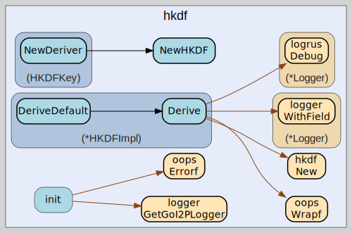

# hkdf
--
    import "github.com/go-i2p/crypto/hkdf"




## Usage

```go
const (
	// DefaultKeyLength specifies the default derived key length for I2P operations.
	// Set to 32 bytes (256 bits) to provide optimal security for ChaCha20 symmetric encryption
	// and other I2P cryptographic primitives that require 256-bit keys.
	DefaultKeyLength = 32 // 256 bits for ChaCha20

	// MaxInfoLength defines the maximum allowed length for HKDF info parameter.
	// Limited to 255 bytes per RFC 5869 specification to ensure compatibility with
	// HMAC-based key derivation and prevent potential buffer overflow issues.
	MaxInfoLength = 255 // Maximum info length for HKDF
)
```
Default parameters for I2P compatibility

```go
var (
	// ErrInvalidKeyLength indicates that the requested key derivation length is invalid.
	// This error occurs when the key length parameter is zero, negative, or exceeds the
	// maximum output length supported by the underlying hash function (255 * hash_length).
	ErrInvalidKeyLength = oops.Errorf("invalid key length")

	// ErrInvalidSaltLength indicates that the provided salt parameter has invalid length.
	// While HKDF allows empty salts, this error is triggered for salt values that exceed
	// implementation-specific limits or fail validation checks.
	ErrInvalidSaltLength = oops.Errorf("invalid salt length")

	// ErrInvalidInfoLength indicates that the info parameter exceeds maximum allowed length.
	// HKDF limits the info parameter to 255 bytes to maintain compatibility with the
	// underlying HMAC construction and prevent potential security issues.
	ErrInvalidInfoLength = oops.Errorf("invalid info length")

	// ErrKeyDerivationFailed indicates that the HKDF key derivation process failed.
	// This error wraps underlying failures in the HKDF-Extract or HKDF-Expand phases,
	// typically due to insufficient entropy or implementation errors.
	ErrKeyDerivationFailed = oops.Errorf("key derivation failed")
)
```
Common HKDF errors

#### func  NewHKDF

```go
func NewHKDF() types.KeyDeriver
```
NewHKDF creates a new HKDF key deriver using SHA-256 hash function. Returns a
types.KeyDeriver that implements RFC 5869 HKDF for secure key expansion with
default parameters optimized for I2P cryptographic operations. NewHKDF returns a
types.KeyDeriver for HKDF using SHA-256

#### func  NewHKDFWithHash

```go
func NewHKDFWithHash(hashFunc func() hash.Hash) types.KeyDeriver
```
NewHKDFWithHash creates a new HKDF key deriver with a custom hash function.
Allows specification of alternative hash algorithms for specialized
cryptographic requirements while maintaining RFC 5869 compliance. Example: hkdf
:= NewHKDFWithHash(sha512.New) for SHA-512 based key derivation. NewHKDFWithHash
returns a types.KeyDeriver for HKDF using a custom hash function

#### type HKDFImpl

```go
type HKDFImpl struct {
}
```

HKDFImpl provides the concrete implementation of HKDF key derivation using
SHA-256. This structure encapsulates the hash function and implements the
types.KeyDeriver interface for extracting and expanding cryptographic keys
according to RFC 5869 specification.

#### func (*HKDFImpl) Derive

```go
func (h *HKDFImpl) Derive(ikm, salt, info []byte, keyLen int) ([]byte, error)
```
Derive implements types.KeyDeriver for HKDF key derivation operations. Derives a
cryptographic key of specified length from input key material using RFC 5869
HKDF. Parameters: ikm (input key material), salt (optional random value), info
(context data), keyLen (output length). Returns derived key bytes or error if
derivation fails due to invalid parameters. Derive derives a key of the
specified length from the input key material (IKM)

#### func (*HKDFImpl) DeriveDefault

```go
func (h *HKDFImpl) DeriveDefault(ikm []byte) ([]byte, error)
```
DeriveDefault provides convenient HKDF key derivation with I2P standard
parameters. Derives a 32-byte key from input key material using no salt and no
contextual info. Optimized for I2P applications requiring ChaCha20-compatible
256-bit keys. DeriveDefault derives a key using default parameters (32 bytes, no
salt, no info)

#### type HKDFKey

```go
type HKDFKey struct{}
```

HKDFKey provides a standard entry point for HKDF key derivation operations. This
type implements the I2P cryptographic interface pattern, allowing creation of
key derivers that follow RFC 5869 HKDF specification for secure key expansion.

#### func (HKDFKey) NewDeriver

```go
func (k HKDFKey) NewDeriver() types.KeyDeriver
```
NewDeriver returns a types.KeyDeriver for HKDF


hkdf 

github.com/go-i2p/crypto/hkdf

[go-i2p template file](/template.md)
