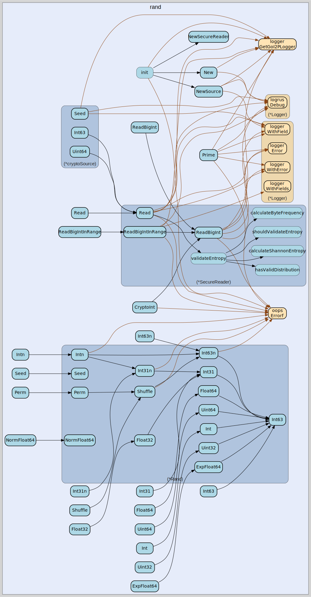

# rand
--
    import "github.com/go-i2p/crypto/rand"




## Usage

```go
const (
	// Minimum entropy threshold for random data (bits per byte)
	// Reduced to 4.0 for crypto/rand compatibility while still catching patterns
	MinEntropyThreshold = 4.0

	// Maximum retry attempts for entropy validation
	MaxEntropyRetries = 10

	// Sample size for entropy testing
	EntropySampleSize = 1024
)
```
Entropy validation constants

```go
var (
	ErrInsufficientEntropy = oops.Errorf("insufficient entropy in random source")
	ErrRandomReadFailed    = oops.Errorf("failed to read from random source")
	ErrEntropyValidation   = oops.Errorf("entropy validation failed")
)
```
Common errors for random number generation

```go
var DefaultSecureReader = NewSecureReader()
```
Global secure reader instance

#### func  Read

```go
func Read(p []byte) (n int, err error)
```
Read fills the provided byte slice with cryptographically secure random data

#### func  ReadBigInt

```go
func ReadBigInt(max *big.Int) (*big.Int, error)
```
ReadBigInt generates a cryptographically secure big.Int in the range [0, max)

#### func  ReadBigIntInRange

```go
func ReadBigIntInRange(min, max *big.Int) (*big.Int, error)
```
ReadBigIntInRange generates a cryptographically secure big.Int in the range
[min, max)

#### type SecureReader

```go
type SecureReader struct {
}
```

SecureReader provides cryptographically secure random number generation with
entropy validation for the go-i2p/crypto library

#### func  NewSecureReader

```go
func NewSecureReader() *SecureReader
```
NewSecureReader creates a new SecureReader using crypto/rand as the source

#### func (*SecureReader) Read

```go
func (sr *SecureReader) Read(p []byte) (n int, err error)
```
Read fills the provided byte slice with cryptographically secure random data and
validates entropy before returning

#### func (*SecureReader) ReadBigInt

```go
func (sr *SecureReader) ReadBigInt(max *big.Int) (*big.Int, error)
```
ReadBigInt generates a cryptographically secure big.Int in the range [0, max)

#### func (*SecureReader) ReadBigIntInRange

```go
func (sr *SecureReader) ReadBigIntInRange(min, max *big.Int) (*big.Int, error)
```
ReadBigIntInRange generates a cryptographically secure big.Int in the range
[min, max)


rand 

github.com/go-i2p/crypto/rand

[go-i2p template file](/template.md)
