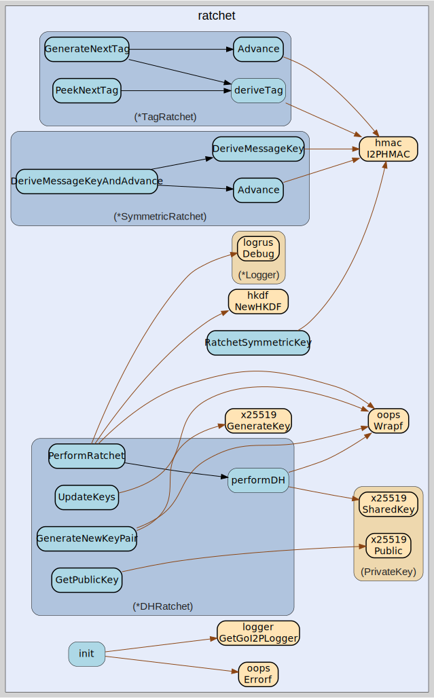

# ratchet
--
    import "github.com/go-i2p/crypto/ratchet"



Package ratchet implements cryptographic ratcheting mechanisms for I2P
protocols.

This package provides three types of ratchets used in modern I2P encryption: 1.
Session Tag Ratchet - Derives unique session tags for message routing 2.
Symmetric Key Ratchet - Derives message encryption keys with forward secrecy 3.
DH Ratchet - Provides forward secrecy through ephemeral key exchanges

The ratcheting mechanisms are used by ECIES-X25519-AEAD-Ratchet and other I2P
protocols requiring forward secrecy and secure key derivation.

Package ratchet Diffie-Hellman ratchet implementation.

Package ratchet symmetric key ratchet implementation.

Package ratchet session tag ratchet implementation.

Package ratchet utility functions.

## Usage

```go
const (
	// ChainKeySize is the size of chain keys in bytes
	ChainKeySize = 32
	// SessionTagSize is the size of session tags in bytes
	SessionTagSize = 8
	// MessageKeySize is the size of message keys in bytes
	MessageKeySize = 32
	// PublicKeySize is the size of X25519 public keys in bytes
	PublicKeySize = 32
	// PrivateKeySize is the size of X25519 private keys in bytes
	PrivateKeySize = 32
)
```
Constants for ratchet operations

```go
var (
	ErrInvalidChainKeySize   = oops.Errorf("invalid chain key size")
	ErrInvalidPublicKeySize  = oops.Errorf("invalid public key size")
	ErrInvalidPrivateKeySize = oops.Errorf("invalid private key size")
	ErrTagDerivationFailed   = oops.Errorf("session tag derivation failed")
	ErrKeyDerivationFailed   = oops.Errorf("key derivation failed")
	ErrDHFailed              = oops.Errorf("Diffie-Hellman exchange failed")
)
```
Error constants for ratchet operations

#### func  RatchetSymmetricKey

```go
func RatchetSymmetricKey(chainKey [ChainKeySize]byte, messageNum uint32) ([MessageKeySize]byte, [ChainKeySize]byte, error)
```
RatchetSymmetricKey is a helper function that derives the next message key and
new chain key for symmetric ratcheting. This combines message key derivation and
chain key advancement in one operation.

#### type DHRatchet

```go
type DHRatchet struct {
}
```

DHRatchet implements the Diffie-Hellman ratchet for forward secrecy. It performs
periodic DH key exchanges to derive new chain keys.

The DH ratchet provides the strongest form of forward secrecy - even if an
attacker compromises the current state, they cannot decrypt past messages.

#### func  NewDHRatchet

```go
func NewDHRatchet(rootKey, ourPrivKey, theirPubKey [ChainKeySize]byte) *DHRatchet
```
NewDHRatchet creates a new DH ratchet with initial root key and keys.

#### func (*DHRatchet) GenerateNewKeyPair

```go
func (r *DHRatchet) GenerateNewKeyPair() ([PublicKeySize]byte, error)
```
GenerateNewKeyPair generates a new ephemeral key pair for this ratchet.

#### func (*DHRatchet) GetPublicKey

```go
func (r *DHRatchet) GetPublicKey() ([PublicKeySize]byte, error)
```
GetPublicKey returns our current DH public key.

#### func (*DHRatchet) PerformRatchet

```go
func (r *DHRatchet) PerformRatchet() ([ChainKeySize]byte, [ChainKeySize]byte, error)
```
PerformRatchet performs a DH ratchet step. Returns (sendingChainKey,
receivingChainKey, error). This derives new chain keys from a fresh DH exchange.

#### func (*DHRatchet) UpdateKeys

```go
func (r *DHRatchet) UpdateKeys(newTheirPubKey []byte) error
```
UpdateKeys updates the DH ratchet with a new remote public key.

#### func (*DHRatchet) Zero

```go
func (r *DHRatchet) Zero()
```
Zero securely clears the DH ratchet state from memory.

#### type SymmetricRatchet

```go
type SymmetricRatchet struct {
}
```

SymmetricRatchet implements the symmetric key ratchet for deriving message keys.
Each message is encrypted with a unique key derived from the chain key.

The ratchet provides forward secrecy - message keys cannot be derived from later
chain keys, and compromise of one message key doesn't affect others.

#### func  NewSymmetricRatchet

```go
func NewSymmetricRatchet(initialChainKey [ChainKeySize]byte) *SymmetricRatchet
```
NewSymmetricRatchet creates a new symmetric key ratchet.

#### func (*SymmetricRatchet) Advance

```go
func (r *SymmetricRatchet) Advance() error
```
Advance advances the symmetric ratchet by deriving a new chain key. Uses
HMAC-SHA256(chainKey, "NextChainKey").

#### func (*SymmetricRatchet) DeriveMessageKey

```go
func (r *SymmetricRatchet) DeriveMessageKey(messageNum uint32) ([MessageKeySize]byte, error)
```
DeriveMessageKey derives a message encryption key for the given message number.
Uses HMAC-SHA256(chainKey, "MessageKey" || messageNum).

#### func (*SymmetricRatchet) DeriveMessageKeyAndAdvance

```go
func (r *SymmetricRatchet) DeriveMessageKeyAndAdvance(messageNum uint32) ([MessageKeySize]byte, [ChainKeySize]byte, error)
```
DeriveMessageKeyAndAdvance derives a message key and advances the chain in one
operation. This is a convenience function combining DeriveMessageKey and
Advance.

#### func (*SymmetricRatchet) GetChainKey

```go
func (r *SymmetricRatchet) GetChainKey() [ChainKeySize]byte
```
GetChainKey returns the current chain key (for inspection/debugging).

#### func (*SymmetricRatchet) Zero

```go
func (r *SymmetricRatchet) Zero()
```
Zero securely clears the symmetric ratchet state from memory.

#### type TagRatchet

```go
type TagRatchet struct {
}
```

TagRatchet implements the session tag ratchet for deriving unique session tags.
Session tags are 8-byte identifiers used to route existing session messages
without revealing session metadata in cleartext.

The ratchet uses HMAC-SHA256 to derive tags and chain keys, ensuring forward
secrecy - past tags cannot be derived from current state.

#### func  NewTagRatchet

```go
func NewTagRatchet(initialChainKey [ChainKeySize]byte) *TagRatchet
```
NewTagRatchet creates a new session tag ratchet from an initial chain key.

#### func (*TagRatchet) Advance

```go
func (r *TagRatchet) Advance() error
```
Advance advances the tag ratchet by deriving a new chain key. Uses
HMAC-SHA256(chainKey, "NextChainKey" || tagCount) for forward secrecy.

#### func (*TagRatchet) GenerateNextTag

```go
func (r *TagRatchet) GenerateNextTag() ([SessionTagSize]byte, error)
```
GenerateNextTag derives the next 8-byte session tag and advances the ratchet.
Each tag is uniquely derived from the chain key and tag count using HMAC-SHA256.

#### func (*TagRatchet) GetTagCount

```go
func (r *TagRatchet) GetTagCount() uint32
```
GetTagCount returns the current tag count (number of tags generated).

#### func (*TagRatchet) PeekNextTag

```go
func (r *TagRatchet) PeekNextTag() ([SessionTagSize]byte, error)
```
PeekNextTag derives the next session tag without advancing the ratchet. This is
used for tag validation without commitment.

#### func (*TagRatchet) Zero

```go
func (r *TagRatchet) Zero()
```
Zero securely clears the tag ratchet state from memory.


ratchet 

github.com/go-i2p/crypto/ratchet

[go-i2p template file](/template.md)
