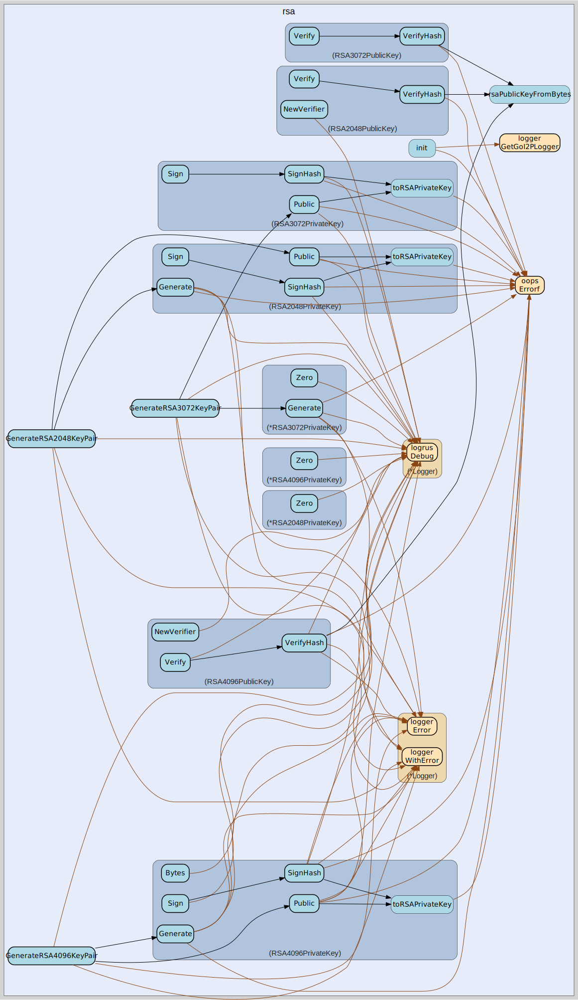

# rsa
--
    import "github.com/go-i2p/crypto/rsa"




## Usage

```go
var (
	// ErrInvalidKeySize indicates that the provided RSA key size is not supported or valid.
	// Valid RSA key sizes in I2P are 2048, 3072, and 4096 bits.
	ErrInvalidKeySize = oops.Errorf("invalid RSA key size")

	// ErrInvalidKeyFormat indicates that the RSA key data is malformed or corrupted.
	// RSA keys must follow I2P's standard byte array format for proper parsing.
	ErrInvalidKeyFormat = oops.Errorf("invalid RSA key format")

	// ErrSignatureFailed indicates that the RSA signature generation operation failed.
	// This can occur due to invalid keys, insufficient entropy, or cryptographic errors.
	ErrSignatureFailed = oops.Errorf("RSA signature operation failed")

	// ErrVerificationFailed indicates that RSA signature verification failed.
	// This occurs when a signature does not match the provided data and public key.
	ErrVerificationFailed = oops.Errorf("RSA signature verification failed")
)
```
Error constants for RSA operations

#### func  GenerateRSA2048KeyPair

```go
func GenerateRSA2048KeyPair() (*RSA2048PublicKey, *RSA2048PrivateKey, error)
```
GenerateRSA2048KeyPair generates a new RSA-2048 key pair for I2P cryptographic
operations. Returns a public key for verification and a private key for signing
operations. RSA-2048 provides 112-bit equivalent security and is suitable for
most I2P applications. The generated keys follow I2P's standard byte array
format for compatibility. Example usage: pubKey, privKey, err :=
GenerateRSA2048KeyPair()

#### func  GenerateRSA3072KeyPair

```go
func GenerateRSA3072KeyPair() (*RSA3072PublicKey, *RSA3072PrivateKey, error)
```
GenerateRSA3072KeyPair generates a new RSA-3072 key pair for enhanced I2P
security. Returns a public key for verification and a private key for signing
operations. RSA-3072 provides 128-bit equivalent security, suitable for
high-security I2P applications. The generated keys follow I2P's standard byte
array format for network compatibility. Example usage: pubKey, privKey, err :=
GenerateRSA3072KeyPair()

#### func  GenerateRSA4096KeyPair

```go
func GenerateRSA4096KeyPair() (*RSA4096PublicKey, *RSA4096PrivateKey, error)
```
GenerateRSA4096KeyPair generates a new RSA-4096 key pair for maximum I2P
security. Returns a public key for verification and a private key for signing
operations. RSA-4096 provides 192-bit equivalent security, the highest security
level in the RSA family. The generated keys follow I2P's standard byte array
format for network interoperability. Example usage: pubKey, privKey, err :=
GenerateRSA4096KeyPair()

#### type RSA2048PrivateKey

```go
type RSA2048PrivateKey struct {
	RSA2048PrivateKey [512]byte // I2P-compliant: 256 bytes modulus + 256 bytes private exponent
}
```

RSA2048PrivateKey represents a 2048-bit RSA private key in I2P format. The key
data is stored as a 512-byte array containing both the modulus (256 bytes) and
private exponent (256 bytes) as specified by I2P cryptographic standards. This
type implements types.Signer for creating digital signatures. Example usage:
privKey := RSA2048PrivateKey{}; sig, err := privKey.Sign(data)

#### func (RSA2048PrivateKey) Bytes

```go
func (r RSA2048PrivateKey) Bytes() []byte
```
Bytes implements types.PrivateKey. Returns the raw bytes of the private key

#### func (RSA2048PrivateKey) Generate

```go
func (r RSA2048PrivateKey) Generate() (types.SigningPrivateKey, error)
```
Generate implements types.SigningPrivateKey.

#### func (RSA2048PrivateKey) Len

```go
func (r RSA2048PrivateKey) Len() int
```
Len implements types.SigningPrivateKey.

#### func (RSA2048PrivateKey) NewSigner

```go
func (r RSA2048PrivateKey) NewSigner() (types.Signer, error)
```
NewSigner implements types.SigningPrivateKey.

#### func (RSA2048PrivateKey) Public

```go
func (r RSA2048PrivateKey) Public() (types.SigningPublicKey, error)
```
Public implements types.PrivateKey. Extracts the public key from the private key

#### func (RSA2048PrivateKey) Sign

```go
func (r RSA2048PrivateKey) Sign(data []byte) (sig []byte, err error)
```
Sign implements types.Signer. Signs data by first hashing it with SHA-256

#### func (RSA2048PrivateKey) SignHash

```go
func (r RSA2048PrivateKey) SignHash(h []byte) (sig []byte, err error)
```
SignHash implements types.Signer. Signs a pre-computed hash

#### func (*RSA2048PrivateKey) Zero

```go
func (r *RSA2048PrivateKey) Zero()
```
Zero implements types.PrivateKey. Securely erases key material

#### type RSA2048PublicKey

```go
type RSA2048PublicKey [256]byte
```

RSA2048PublicKey represents a 2048-bit RSA public key in I2P format. The key is
stored as a 256-byte array containing the public key modulus. This type
implements types.Verifier for signature verification operations. Example usage:
pubKey := RSA2048PublicKey{}; err := pubKey.Verify(data, signature)

#### func (RSA2048PublicKey) Bytes

```go
func (r RSA2048PublicKey) Bytes() []byte
```
Bytes implements SigningPublicKey. Returns the raw bytes of the public key

#### func (RSA2048PublicKey) Len

```go
func (r RSA2048PublicKey) Len() int
```
Len implements SigningPublicKey. Returns the length of the public key in bytes

#### func (RSA2048PublicKey) NewVerifier

```go
func (r RSA2048PublicKey) NewVerifier() (types.Verifier, error)
```
NewVerifier implements SigningPublicKey. Creates a new verifier object that can
be used to verify signatures

#### func (RSA2048PublicKey) Verify

```go
func (r RSA2048PublicKey) Verify(data []byte, sig []byte) error
```
Verify implements types.Verifier. This method hashes the data with SHA-256 and
verifies the signature

#### func (RSA2048PublicKey) VerifyHash

```go
func (r RSA2048PublicKey) VerifyHash(h []byte, sig []byte) error
```
VerifyHash implements types.Verifier. This method verifies a pre-computed hash
against the signature

#### type RSA3072PrivateKey

```go
type RSA3072PrivateKey struct {
	RSA3072PrivateKey [768]byte // I2P-compliant: 384 bytes modulus + 384 bytes private exponent
}
```

RSA3072PrivateKey represents a 3072-bit RSA private key in I2P format. The key
data is stored as a 768-byte array containing the modulus (384 bytes) and
private exponent (384 bytes) following I2P cryptographic specifications. This
type implements types.Signer and provides enhanced security over RSA-2048.
RSA-3072 offers equivalent security to 128-bit symmetric encryption.

#### func (RSA3072PrivateKey) Bytes

```go
func (r RSA3072PrivateKey) Bytes() []byte
```
Bytes implements types.PrivateKey - returns raw key bytes

#### func (*RSA3072PrivateKey) Generate

```go
func (r *RSA3072PrivateKey) Generate() (types.SigningPrivateKey, error)
```
Generate creates a new RSA-3072 private key

#### func (*RSA3072PrivateKey) Len

```go
func (r *RSA3072PrivateKey) Len() int
```
Len implements types.SigningPrivateKey.

#### func (*RSA3072PrivateKey) NewSigner

```go
func (r *RSA3072PrivateKey) NewSigner() (types.Signer, error)
```
NewSigner implements types.SigningPrivateKey.

#### func (RSA3072PrivateKey) Public

```go
func (r RSA3072PrivateKey) Public() (types.SigningPublicKey, error)
```
Public implements types.PrivateKey - derives public key from private key

#### func (RSA3072PrivateKey) Sign

```go
func (r RSA3072PrivateKey) Sign(data []byte) (sig []byte, err error)
```
Sign implements types.Signer - signs data with SHA512 hash

#### func (RSA3072PrivateKey) SignHash

```go
func (r RSA3072PrivateKey) SignHash(h []byte) (sig []byte, err error)
```
SignHash implements types.Signer - signs a pre-computed hash

#### func (*RSA3072PrivateKey) Zero

```go
func (r *RSA3072PrivateKey) Zero()
```
Zero implements types.PrivateKey - securely erases key material

#### type RSA3072PublicKey

```go
type RSA3072PublicKey [384]byte
```

RSA3072PublicKey represents a 3072-bit RSA public key in I2P format. The key is
stored as a 384-byte array containing the public key modulus. This type
implements types.Verifier for signature verification with enhanced security.
RSA-3072 provides equivalent security to 128-bit symmetric encryption.

#### func (RSA3072PublicKey) Bytes

```go
func (r RSA3072PublicKey) Bytes() []byte
```
Bytes implements SigningPublicKey.

#### func (RSA3072PublicKey) Len

```go
func (r RSA3072PublicKey) Len() int
```
Len implements SigningPublicKey.

#### func (RSA3072PublicKey) NewVerifier

```go
func (r RSA3072PublicKey) NewVerifier() (types.Verifier, error)
```
NewVerifier implements SigningPublicKey.

#### func (RSA3072PublicKey) Verify

```go
func (r RSA3072PublicKey) Verify(data []byte, sig []byte) error
```
Verify implements types.Verifier.

#### func (RSA3072PublicKey) VerifyHash

```go
func (r RSA3072PublicKey) VerifyHash(h []byte, sig []byte) error
```
VerifyHash implements types.Verifier.

#### type RSA4096PrivateKey

```go
type RSA4096PrivateKey struct {
	RSA4096PrivateKey [1024]byte // I2P-compliant: 512 bytes modulus + 512 bytes private exponent
}
```

RSA4096PrivateKey represents a 4096-bit RSA private key in I2P format. The key
data is stored as a 1024-byte array containing the modulus (512 bytes) and
private exponent (512 bytes) following I2P cryptographic specifications. This
type implements types.Signer and provides maximum security in the RSA family.
RSA-4096 offers equivalent security to 192-bit symmetric encryption.

#### func (RSA4096PrivateKey) Bytes

```go
func (r RSA4096PrivateKey) Bytes() []byte
```
Bytes implements types.PrivateKey. Returns the raw bytes of the private key

#### func (RSA4096PrivateKey) Generate

```go
func (r RSA4096PrivateKey) Generate() (types.SigningPrivateKey, error)
```
Generate implements types.SigningPrivateKey.

#### func (RSA4096PrivateKey) Len

```go
func (r RSA4096PrivateKey) Len() int
```
Len implements types.SigningPrivateKey.

#### func (RSA4096PrivateKey) NewSigner

```go
func (r RSA4096PrivateKey) NewSigner() (types.Signer, error)
```
NewSigner implements types.SigningPrivateKey.

#### func (RSA4096PrivateKey) Public

```go
func (r RSA4096PrivateKey) Public() (types.SigningPublicKey, error)
```
Public implements types.PrivateKey. Extracts the public key from the private key

#### func (RSA4096PrivateKey) Sign

```go
func (r RSA4096PrivateKey) Sign(data []byte) (sig []byte, err error)
```
Sign implements types.Signer. Signs data by first hashing it with SHA-512

#### func (RSA4096PrivateKey) SignHash

```go
func (r RSA4096PrivateKey) SignHash(h []byte) (sig []byte, err error)
```
SignHash implements types.Signer. Signs a pre-computed hash

#### func (*RSA4096PrivateKey) Zero

```go
func (r *RSA4096PrivateKey) Zero()
```
Zero implements types.PrivateKey. Securely clears the private key from memory

#### type RSA4096PublicKey

```go
type RSA4096PublicKey [512]byte
```

RSA4096PublicKey represents a 4096-bit RSA public key in I2P format. The key is
stored as a 512-byte array containing the public key modulus. This type
implements types.Verifier for signature verification with maximum security.
RSA-4096 provides equivalent security to 192-bit symmetric encryption.

#### func (RSA4096PublicKey) Bytes

```go
func (r RSA4096PublicKey) Bytes() []byte
```
Bytes implements SigningPublicKey. Returns the raw bytes of the public key

#### func (RSA4096PublicKey) Len

```go
func (r RSA4096PublicKey) Len() int
```
Len implements SigningPublicKey. Returns the length of the public key in bytes

#### func (RSA4096PublicKey) NewVerifier

```go
func (r RSA4096PublicKey) NewVerifier() (types.Verifier, error)
```
NewVerifier implements SigningPublicKey. Creates a new verifier instance for
this public key

#### func (RSA4096PublicKey) Verify

```go
func (r RSA4096PublicKey) Verify(data []byte, sig []byte) error
```
Verify implements types.Verifier. This method hashes the data with SHA-512 and
verifies the signature

#### func (RSA4096PublicKey) VerifyHash

```go
func (r RSA4096PublicKey) VerifyHash(h []byte, sig []byte) error
```
VerifyHash implements types.Verifier. This method verifies a pre-computed hash
against the signature


rsa 

github.com/go-i2p/crypto/rsa

[go-i2p template file](/template.md)
