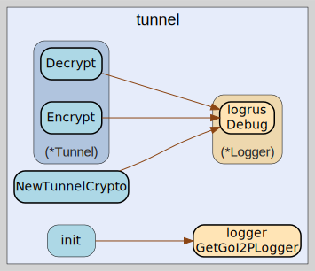

# tunnel
--
    import "github.com/go-i2p/crypto/tunnel"



Package tunnel implements I2P-specific tunnel cryptography for secure data
transmission.

This package provides cryptographic primitives for I2P tunnel layer encryption
and decryption, implementing the dual-layer encryption scheme used in I2P
network tunnels. The tunnel cryptography uses AES-256 in CBC mode with separate
layer and IV encryption keys to provide security against traffic analysis and
ensure forward secrecy within the I2P anonymous network.

The implementation follows I2P's tunnel message format with 1028-byte fixed-size
messages, where the first 16 bytes serve as the initialization vector and the
remaining 1008 bytes contain the encrypted payload data.

Key features:

    - Dual-layer AES encryption with separate keys for layer and IV operations
    - Fixed 1028-byte tunnel message format for network compatibility
    - CBC mode encryption with IV-based randomization
    - Secure in-place encryption/decryption operations

package for i2p specific crpytography

## Usage

#### type Tunnel

```go
type Tunnel struct {
}
```

Tunnel represents a cryptographic tunnel with dual-layer AES encryption
capabilities. It maintains separate cipher blocks for layer encryption and IV
encryption operations, implementing I2P's tunnel cryptography scheme for secure
data transmission through the network. The dual-layer approach provides enhanced
security by encrypting both the data payload and the initialization vector used
for subsequent encryption operations. Tunnel represents a cryptographic tunnel
with layer and IV encryption keys. Moved from: tunnel.go

#### func  NewTunnelCrypto

```go
func NewTunnelCrypto(layerKey, ivKey TunnelKey) (t *Tunnel, err error)
```
NewTunnelCrypto creates a new tunnel cryptographic instance with the provided
AES keys. Both layerKey and ivKey must be exactly 32 bytes (256 bits) for
AES-256 compatibility. The function initializes separate AES cipher blocks for
dual-layer tunnel encryption, following I2P's tunnel cryptography specification
for secure data transmission. Returns a configured Tunnel instance or an error
if cipher creation fails due to invalid keys. Example usage: tunnel, err :=
NewTunnelCrypto(layerKey, ivKey) NewTunnelCrypto creates a new tunnel
cryptographic instance with the provided keys. Returns a new Tunnel instance or
an error if cipher creation fails. Moved from: tunnel.go

#### func (*Tunnel) Decrypt

```go
func (t *Tunnel) Decrypt(td *TunnelData)
```
Decrypt performs in-place dual-layer AES decryption on tunnel data following I2P
protocol. The decryption process reverses the encryption stages: IV decryption,
CBC layer decryption, and final IV decryption. This approach correctly decrypts
data that was encrypted using the dual-layer tunnel encryption scheme. The first
16 bytes of tunnel data serve as the IV, while bytes 16-1024 contain the
encrypted payload. The operation modifies the input TunnelData structure in
place for memory efficiency. Decrypt decrypts tunnel data in place using the
tunnel's decryption keys. Moved from: tunnel.go

#### func (*Tunnel) Encrypt

```go
func (t *Tunnel) Encrypt(td *TunnelData)
```
Encrypt performs in-place dual-layer AES encryption on tunnel data following I2P
protocol. The encryption process applies three stages: IV encryption, CBC layer
encryption, and final IV encryption. This approach ensures both the data payload
and initialization vector are cryptographically protected. The first 16 bytes of
tunnel data serve as the IV, while bytes 16-1024 contain the encrypted payload.
The operation modifies the input TunnelData structure in place for memory
efficiency. Encrypt encrypts tunnel data in place using the tunnel's encryption
keys. Moved from: tunnel.go

#### type TunnelData

```go
type TunnelData [1028]byte
```

TunnelData represents the standardized data structure for I2P tunnel messages
(1028 bytes total). The structure follows I2P's tunnel message format where the
first 16 bytes serve as the initialization vector (IV) and the remaining 1008
bytes contain the encrypted payload data. This fixed-size format ensures network
compatibility and provides consistent message boundaries for tunnel encryption
operations. The 1028-byte size aligns with I2P's network protocol requirements
for efficient data transmission. TunnelData represents the data structure for
tunnel messages (1028 bytes). Moved from: tunnel.go

#### type TunnelIV

```go
type TunnelIV []byte
```

TunnelIV represents the initialization vector for tunnel message encryption
operations. The IV provides randomization for CBC mode encryption and should be
unique for each tunnel message to prevent cryptographic attacks. In I2P tunnel
messages, the IV occupies the first 16 bytes of the TunnelData structure and
serves as the randomization source for CBC encryption. IVs must be unpredictable
but do not need to be secret, following standard cryptographic practices.
TunnelIV represents the initialization vector for a tunnel message. Moved from:
tunnel.go

#### type TunnelKey

```go
type TunnelKey [32]byte
```

TunnelKey represents a symmetric AES-256 key for encrypting tunnel messages (32
bytes). Each tunnel operation requires two separate TunnelKey instances: one for
layer encryption and another for IV encryption. The 32-byte length provides
256-bit security strength compatible with AES-256 encryption used in I2P tunnel
cryptography. These keys should be cryptographically random and generated using
secure random number generators. TunnelKey represents a symmetric key for
encrypting tunnel messages (32 bytes). Moved from: tunnel.go


tunnel 

github.com/go-i2p/crypto/tunnel

[go-i2p template file](/template.md)
