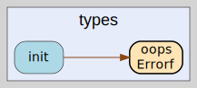

# types
--
    import "github.com/go-i2p/crypto/types"




## Usage

```go
var (
	// ErrBadSignatureSize indicates that a signature has an invalid length for the algorithm.
	// This error is returned when signature bytes don't match the expected size for the signature scheme.
	ErrBadSignatureSize = oops.Errorf("bad signature size")

	// ErrInvalidKeyFormat indicates that a key has invalid format or structure.
	// This error is returned when key bytes cannot be parsed or don't conform to algorithm requirements.
	ErrInvalidKeyFormat = oops.Errorf("invalid key format")

	// ErrInvalidSignature indicates that signature verification failed.
	// This error is returned when a signature is mathematically invalid or doesn't match the data.
	ErrInvalidSignature = oops.Errorf("invalid signature")
)
```
Common error types for digital signature operations across the go-i2p/crypto
library. These standardized errors provide consistent error handling for
signature validation, key format validation, and signature size verification
across all signature algorithms.

```go
var SHA256 = sha256.Sum256
```
SHA256 provides a convenient alias for the standard SHA-256 hash function. This
variable allows direct access to SHA-256 hashing without importing crypto/sha256
in packages that primarily use other cryptographic operations.

#### type Decrypter

```go
type Decrypter interface {
	// Decrypt decrypts the provided ciphertext data and returns the plaintext.
	// It accepts a byte slice containing encrypted data and returns the decrypted plaintext
	// or an error if decryption fails due to invalid data, key, or other cryptographic issues.
	Decrypt(data []byte) ([]byte, error)
}
```

Decrypter interface defines the contract for decrypting data using cryptographic
algorithms. All symmetric and asymmetric decryption implementations must satisfy
this interface to provide consistent decryption operations across the
go-i2p/crypto library.

#### type Encrypter

```go
type Encrypter interface {
	// Encrypt encrypts the provided plaintext data and returns the ciphertext.
	// It accepts a byte slice containing plaintext data and returns the encrypted ciphertext
	// or an error if encryption fails due to invalid data, key, or other cryptographic issues.
	Encrypt(data []byte) (enc []byte, err error)
}
```

Encrypter interface defines the contract for encrypting data using cryptographic
algorithms. All symmetric and asymmetric encryption implementations must satisfy
this interface to provide consistent encryption operations across the
go-i2p/crypto library.

#### type KeyDeriver

```go
type KeyDeriver interface {
	// Derive derives a key of the specified length from the input key material (IKM).
	// Parameters:
	// - ikm: Input key material, the source entropy for key derivation
	// - salt: Optional salt value to ensure different outputs for the same IKM
	// - info: Optional context and application-specific information
	// - keyLen: Desired length of the derived key in bytes
	// Returns the derived key bytes or an error if derivation fails.
	Derive(ikm, salt, info []byte, keyLen int) ([]byte, error)

	// DeriveDefault derives a key using default parameters for common use cases.
	// This method uses standard parameters: 32-byte output, no salt, and no info context.
	// It provides a simplified interface for basic key derivation scenarios.
	DeriveDefault(ikm []byte) ([]byte, error)
}
```

KeyDeriver interface provides a standard contract for key derivation functions
(KDFs). Key derivation functions are cryptographic algorithms that derive one or
more secret keys from a secret value such as a master key, password, or
passphrase using a pseudorandom function. This interface enables consistent key
derivation across different cryptographic implementations.

#### type PrivateEncryptionKey

```go
type PrivateEncryptionKey interface {
	// NewDecrypter creates a new Decrypter instance using this private key.
	// The returned decrypter can decrypt data that was encrypted with the corresponding public key.
	// Returns an error if the private key format is invalid or decrypter creation fails.
	NewDecrypter() (Decrypter, error)

	// Public extracts and returns the corresponding public encryption key.
	// This method derives the public key from the private key material without exposing
	// sensitive private key data. Returns an error if key derivation fails.
	Public() (PublicEncryptionKey, error)

	// Bytes returns the raw byte representation of this private key.
	// The returned bytes contain the complete private key material in the format
	// expected by the specific cryptographic algorithm implementation.
	Bytes() []byte

	// Zero securely clears all sensitive private key data from memory.
	// This method should be called when the private key is no longer needed to prevent
	// memory disclosure attacks. After calling Zero, the key becomes unusable.
	Zero()
}
```

PrivateEncryptionKey interface defines the contract for private keys used in
asymmetric encryption. This interface provides methods for creating decrypters,
accessing the corresponding public key, and managing the private key lifecycle
including secure memory cleanup.

#### type PrivateKey

```go
type PrivateKey interface {
	// Public returns the public key corresponding to this private key.
	// This method derives the public key from the private key material for signature verification.
	// Returns an error if the private key is invalid or public key derivation fails.
	Public() (SigningPublicKey, error)

	// Bytes returns the raw byte representation of this private key.
	// The returned bytes contain the complete private key material in the format
	// expected by the specific digital signature algorithm implementation.
	Bytes() []byte

	// Zero securely clears all sensitive private key data from memory.
	// This method overwrites the private key material to prevent memory disclosure attacks.
	// After calling Zero, the private key becomes unusable and should be discarded.
	Zero()
}
```

PrivateKey interface defines the contract for private keys used in digital
signatures. This interface provides methods for accessing the corresponding
public key, retrieving the raw key material, and securely clearing sensitive
data from memory when no longer needed.

#### type PublicEncryptionKey

```go
type PublicEncryptionKey interface {
	// NewEncrypter creates a new Encrypter instance using this public key.
	// The returned encrypter can encrypt data that can only be decrypted with the corresponding
	// private key. Returns an error if the public key format is invalid or encrypter creation fails.
	NewEncrypter() (Encrypter, error)

	// Len returns the length of this public key in bytes.
	// This method provides the size of the key material for validation and serialization purposes.
	Len() int

	// Bytes returns the raw byte representation of this public key.
	// The returned bytes contain the complete public key material in the format
	// expected by the specific cryptographic algorithm implementation.
	Bytes() []byte
}
```

PublicEncryptionKey interface defines the contract for public keys used in
asymmetric encryption. This interface provides methods for creating encrypters
and accessing key metadata required for encrypting data that can only be
decrypted by the corresponding private key.

#### type PublicKey

```go
type PublicKey interface {
	// Len returns the length of this public key in bytes.
	// This method provides the size of the key material for validation, serialization,
	// and buffer allocation purposes across different cryptographic implementations.
	Len() int

	// Bytes returns the raw byte representation of this public key.
	// The returned bytes contain the complete public key material in the format
	// expected by the specific cryptographic algorithm implementation.
	Bytes() []byte
}
```

PublicKey interface defines the basic contract for all public key types. This
interface provides fundamental methods for accessing key metadata and raw key
material that are common across different cryptographic algorithms and key
purposes.

#### type ReceivingPublicKey

```go
type ReceivingPublicKey interface {
	// Len returns the length of this public key in bytes.
	// This method provides the size of the key material for validation and serialization purposes.
	Len() int

	// Bytes returns the raw byte representation of this public key.
	// The returned bytes contain the complete public key material formatted for the encryption algorithm.
	Bytes() []byte

	// NewEncrypter creates a new Encrypter instance using this public key.
	// The returned encrypter can encrypt data that can only be decrypted by the holder
	// of the corresponding private key. Returns an error if encrypter creation fails.
	NewEncrypter() (Encrypter, error)
}
```

ReceivingPublicKey interface defines the contract for public keys used for
receiving encrypted data. This interface extends the basic PublicKey interface
with encryption capabilities, enabling the creation of encrypters for secure
data transmission to the key holder.

#### type Signer

```go
type Signer interface {
	// Sign creates a digital signature for the provided data.
	// This convenience method hashes the data internally and calls SignHash.
	// It provides a simplified interface for applications that don't need to manage hashing separately.
	Sign(data []byte) (sig []byte, err error)

	// SignHash creates a digital signature for a pre-computed hash.
	// This method accepts a hash digest and returns the signature bytes.
	// This is the primary signing method for performance-critical applications and when
	// custom hashing algorithms or multiple signature operations are needed.
	SignHash(h []byte) (sig []byte, err error)
}
```

Signer interface defines the contract for creating digital signatures. All
signature creation implementations must satisfy this interface to provide
consistent signing operations across different cryptographic algorithms in the
library.

#### type SigningPrivateKey

```go
type SigningPrivateKey interface {
	// NewSigner creates a new Signer instance using this private key.
	// The returned signer can create digital signatures that can be verified with the
	// corresponding public key. Returns an error if the private key format is invalid.
	NewSigner() (Signer, error)

	// Len returns the length of this private key in bytes.
	// This method provides the size of the key material for validation and serialization purposes.
	Len() int

	// Public extracts and returns the corresponding public signing key.
	// This method derives the public key from the private key material for signature verification.
	// Returns an error if the private key is invalid or public key derivation fails.
	Public() (SigningPublicKey, error)

	// Generate creates a new private key and stores it in this instance.
	// This method replaces the current key material with a newly generated private key.
	// Returns the updated private key instance or an error if key generation fails.
	Generate() (SigningPrivateKey, error)
}
```

SigningPrivateKey interface defines the contract for private keys used in
digital signatures. This interface provides methods for creating signers,
generating new keys, and managing the private key lifecycle including access to
the corresponding public key.

#### type SigningPublicKey

```go
type SigningPublicKey interface {
	// NewVerifier creates a new Verifier instance using this public key.
	// The returned verifier can validate signatures created with the corresponding private key.
	// Returns an error if the public key format is invalid or verifier creation fails.
	NewVerifier() (Verifier, error)

	// Len returns the length of this public key in bytes.
	// This method provides the size of the key material for validation and serialization purposes.
	Len() int

	// Bytes returns the raw byte representation of this public key.
	// The returned bytes contain the complete public key material in the format
	// expected by the specific digital signature algorithm implementation.
	Bytes() []byte
}
```

SigningPublicKey interface defines the contract for public keys used in digital
signatures. This interface provides methods for creating signature verifiers and
accessing key metadata required for validating signatures created by the
corresponding private key.

#### type Verifier

```go
type Verifier interface {
	// VerifyHash verifies a digital signature against a pre-computed hash.
	// This method accepts a hash digest and signature bytes, returning nil if the signature
	// is mathematically valid for the hash, or an error if verification fails.
	// This is the primary verification method for performance-critical applications.
	VerifyHash(h, sig []byte) error

	// Verify verifies a digital signature against raw data.
	// This convenience method hashes the data internally and calls VerifyHash.
	// It provides a simplified interface for applications that don't need to manage hashing separately.
	Verify(data, sig []byte) error
}
```

Verifier interface defines the contract for verifying digital signatures. All
signature verification implementations must satisfy this interface to provide
consistent signature validation across different cryptographic algorithms in the
library.


types 

github.com/go-i2p/crypto/types

[go-i2p template file](/template.md)
